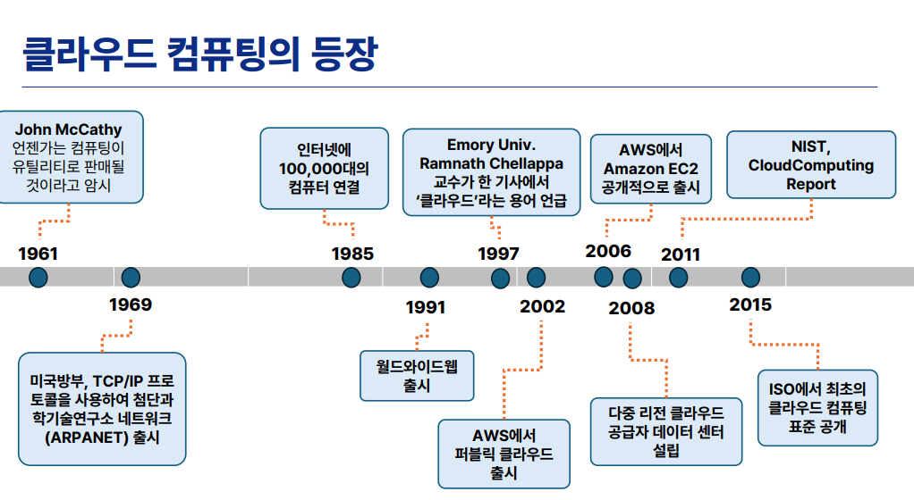

# AWS 클라우드AI_BASIC_OT

요약

### 액션 아이템

- [ ]  내일 수업 전까지 AWS 계정(프리티어) 신규 생성
    - 해외 결제 가능한 신용카드 필요 (1달러 결제 후 즉시 취소)
    - 작년 7월 이후 기준: 최대 6개월, 최대 200달러 한도
- [ ]  내일 오전 10시 명신관 104호 수업 참석

---

### 클라우드 인프라 유형 3가지

- **온프레미스**: 회사 내에 서버를 직접 구매·설치·운영하는 방식
- **코로케이션**: 서버 장비는 회사 소유이나, 외부 데이터센터에 입주하여 운영
- **클라우드**: 정확한 위치를 모르는 채로 네트워크를 통해 필요한 자원만 사용하는 방식
- 금융 등 민감 정보는 온프레미스, 일반 서비스는 클라우드에 두는 **혼합 구성**이 흔함

### 클라우드 컴퓨팅의 역사

- **1961년**: 존 매카시, "컴퓨팅이 유틸리티(전기·수도처럼)로 판매될 것"이라 예언 → 오늘날 클라우드의 기원
- 존 매카시는 1950년대 중반 **인공지능** 개념도 최초로 제안
- **1991년**: 월드와이드웹(WWW) 시작
- **1997년**: 클라우드 용어 등장
- **2002년**: AWS 퍼블릭 클라우드 출시, **2006년** EC2 서비스 정식 시작 → 클라우드 역사의 기점
- **2010년**: NIST(미국 표준기술연구소)에서 클라우드 컴퓨팅 7페이지 리포트 발표
- **코로나**를 계기로 국내 클라우드 활성화 급격히 가속

### NIST 클라우드 컴퓨팅 정의 - 3-4-5 모델

- **3가지 서비스 모델**: IaaS, PaaS, SaaS
    - SaaS: 사용자가 구현 없이 그대로 사용 (예: Notion, 네이버 마이박스)
    - IaaS: 자원을 직접 제어하고 싶을 때 선택
- **4가지 배포 모델**
    - 퍼블릭 클라우드: 위치·관리 모르고 네트워크로 접근
    - 프라이빗 클라우드: 회사 내부에서 클라우드를 직접 구축·관리 (예: 현대차 도면 등 민감 정보)
    - 하이브리드 클라우드: 온프레미스+클라우드 또는 프라이빗+퍼블릭 혼합
    - 커뮤니티 클라우드: 특정 사용자 집단이 공유 (예: 나이스)
- **5가지 핵심 특징**: 온디맨드 서비스, 광대역 네트워크 접근, 리소스 풀링, 신속한 확장성, 측정 가능 서비스(Measured Service)

### 클라우드 핵심 기반 기술

- **그리드 컴퓨팅**: 서로 다른 지리적 위치의 컴퓨팅 자원을 네트워크로 연결
- **클러스터링**: 자원들을 묶어 하나의 시스템처럼 활용
- **가상화**: 클라우드의 핵심 기술
    - 물리 서버 1대를 논리적으로 여러 대처럼 분할하거나, 여러 대를 1대처럼 통합 가능
    - 서버 가상화 기술 = **하이퍼바이저** (꼭 기억) → AWS EC2의 기반
    - 네트워크·스토리지에도 가상화 기술 적용

### 클라우드 주요 활용 분야

- **빅데이터**: 데이터 저장소·데이터 레이크로 클라우드 활용
- **인공지능/머신러닝**: 모델 학습에 필요한 대규모 인프라를 클라우드로 해결
- **사물인터넷(IoT)**: 차량 센서, 스마트 가전 데이터 등 모두 클라우드 저장
- AI 성장 = 클라우드 수요 동반 성장 구조

### 클라우드 벤더 현황

- **AWS**: 전 세계 시장 점유율 약 30%, 가장 광범위한 서비스(200여 개), 2006년부터 운영
    - 탄생 배경: 블랙프라이데이 이후 놀고 있는 유휴 서버를 임대하는 아이디어에서 출발
- **MS Azure**: 2위, Windows·Office 365와 연동 강점, OpenAI와 협력
- **GCP**: 컨테이너(도커, 쿠버네티스) 기반 작업에 유리, 개발자 친화적 UI
- **국내 클라우드**: 네이버 클라우드, NHN 클라우드, KT 클라우드, 카카오 클라우드
    - 공공기관 클라우드 도입 시 **CSAP 인증** 필요 → 외산은 최근에야 인증 취득

### CSP vs MSP

- **CSP(클라우드 서비스 프로바이더)**: AWS, Azure, GCP, Oracle 등 클라우드를 직접 제공하는 회사
- **MSP(매니지드 서비스 프로바이더)**: CSP의 파트너사, 고객과 직접 접점, 구축·마이그레이션 서비스 제공
- 취업 경로: 보통 MSP에서 경험을 쌓은 후 CSP로 이직하는 경우가 많음

### 국내 클라우드 시장 현황

- 매출 9조 원 규모, 코로나 이후 급성장 후 현재는 완만한 성장세
- **생성형 AI**가 최근 3년간 클라우드 분야 최대 이슈
- **소버린 클라우드** 개념 대두 (국가·공공기관의 데이터 주권)
- **핀옵스(FinOps)**: 클라우드 비용을 재무·경영 관점에서 합리적으로 운영하는 방법론

### 교육 과정 로드맵

- **베이직 과정** (현재): 이틀, 12시간, 클라우드 기본 개념 및 AWS 핵심 서비스
- **에센셜 과정** (다음 주): 본격 AI 서비스 구현 및 프로젝트
- **인텐시브 과정** (8월): 프로젝트 심화
- 향후 검토 중인 내용: 멀티 클라우드 연동 실습(AWS+Azure, AWS+GCP), 자격증 준비반 운영
- **자격증**: 강사는 AWS·GCP·Azure 자격증 모두 보유, 콘솔 직접 실습 후 응시 권장

### 내일 수업 커리큘럼

- **1일 차**: AWS 소개 → 네트워크(가장 어려운 파트) → 컴퓨팅(EC2) → 고가용성·로드밸런싱·오토스케일링
- **2일 차**: 스토리지, 매니지먼트 관련 서비스
- 전체 200여 개 서비스 중 약 10개 핵심 서비스 집중 실습

### AWS 프리티어 계정 안내

- 신규 가입 시 6개월, 최대 200달러 한도 무료 제공 (작년 7월 기준 변경, 이전에는 1년)
- 가입 절차: 이메일 입력 → 인증코드 확인 → 루트 비밀번호 설정 → 무료 플랜 선택 → 연락처 입력 → 카드 등록(1달러 즉시 취소) → 전화번호 인증
- **주의 사항**
    - 사용하지 않는 서비스는 반드시 중지 또는 삭제
    - EIP(고정 IP)는 미사용 시 반납 필수
    - 리전 혼동 주의 (서울 리전과 타 리전 서버 혼동 사례)
    - 빌링에서 프리티어 사용량 알림 및 예산 알림 설정 권장
    - 기존 계정 보유자의 신규 계정 생성은 복불복 (다른 카드·전화번호 활용 가능)

메모

받아쓰기

그래서 내가 진짜로 서버 한 대를 쓰고 있는 건지 아니면 서버라는 장비 아래에 뭐 한 15개 정도의 서버가 있는데 그중 하나만 쓰고 있는 건지, 그런 것들에 대해서 전혀 모르는 거죠. 이제는 알 필요가 없어졌습니다. 이해를 해주시면 되겠습니다. 있기는 있는데 정확하게 어디에 있는지를 모르는 거죠. 그리고 한 대를 쓰는 건지 여러 대로 나눠서 쪼개서 쓰고 있는 건지 그런 것들을 전혀 모르는 상태로 라는 것이 클라우드하고 코로케이션의 차이라고 보시면 되겠습니다.

회사에서 어떤 서비스를 구축한다고 하면 물어보죠. 온프레미스로 구축할 겁니까? 아니면 클라우드로 할 겁니까? 혹은 코로케이션으로 할 겁니까? 그래서 어떤 회사에서는 클라우드로만 100% 구현하는 곳이 있고요, 어떤 곳에서는 온프레미스도 있고, 코로케이션도 있고, 클라우드도 섞어서 쓰는 특히나 금융 정보 같은 경우는 상당히 민감하죠. 그렇기 때문에 그런 민감한 정보는 온프레미스에 두고 중요한 서비스들 내지는 우리 회사의 페이지 뭐 이런 것들은 클라우드에다가 두고 뭐 이런 식으로 분산을 시키는 경우들이 흔하게 있습니다.

자 그래서 이 세 가지 용어를 잘 기억해 두시고요. 이제 클라우드 컴퓨팅이 등장하게 된 그 역사부터 좀 살펴보도록 하겠습니다. 여러분들은 클라우드를 언제 들으셨나요? 언제 처음 클라우드라는 용어를 듣게 되셨나요? 지금 여기 계신 분들의 대부분이 2000년도 이후에 태어나신 분들이시죠? 클라우드가 등장하게 된 역사를 쭉 거슬러 올라가다 보면 저기 1961년도까지 올라가게 됩니다.

60년도에 존 매카시라는 학자가 이렇게 이야기했죠. 언젠가는 컴퓨팅이 유틸리티로 판매될 것이라고 이야기했는데요. 유틸리티라는 말이 생소할 수 있는데, 이게 어떤 개념이냐면 전기나 수도 같은 겁니다. 우리 집에 이사를 했어요. 그러면 전기 코드에다가 우리가 꽂기만 하면 전기를 쓸 수가 있죠. 하지만 내가 그렇게 물을 바로 쓸 수 있고 쓰고 난 뒤에 내가 물을 얼마나 썼다라는 걸 가지고서 비용을 지불하게 됩니다. 이런 것들이 유틸리티 컴퓨팅의 기본적인 컨셉인데요. 그 유틸리티가 오늘날의 클라우드로 발전을 하게 되었죠.

그래서 유틸리티로 컴퓨팅 서비스가 될 것이라고 이야기한 것이 존 매카시라는 사람이고, 하나의 지금 오늘날에 와서 가장 핫한 개념 하나를 이야기를 했습니다. 바로 인공지능입니다. 1950년대 중반에 컴퓨터가 사람이 생각하는 것처럼 뭔가 사고를 할 것이다라는 개념으로 내놓게 되었는데 그것을 이야기를 처음 한 것도 이 존 매카시라는 사람이죠. 자, 그래서 이제 60년도에 존 매카시가 유틸리티 컴퓨팅을 이야기를 했고요. 그 뒤로 여러분들이 이제 뭐 수업을 들으시면서 아마 한 번쯤은 들어보셨을 것 같아요. 미 국방부에서 알파넷이라는 거를

그렇게 해서 이제 인터넷이 10만 대의 컴퓨터를 연결하면서 1980년대 중반에 우리가 따따따라고 부르는 월드와이드웹이라는 개념은 1991년도에 시작을 했습니다. 그리고 나서 97년도에 보면 클라우드라는 용어가 이제 등장을 하기 시작해요. 여기에서 AWS에서 퍼블릭 클라우드를 출시를 한 것은 2002년인데, 실질적으로 서비스를 시작한 것은 2006년입니다. 여러분들 아까 써보셨던 서비스 중에서 EC2라는 서비스가 있었는데, 그래서 이제 2006년도부터 AWS에서 클라우드에 대한 서비스를 시작하게 되었고요.

이 클라우드 서비스에서 제일 첫 번째로 한 것이 AWS죠? 세이지포스닷컴. 죄송해요. 세일즈포스닷컴에서 사스 서비스를 했었고요. 그 뒤에 gcp라든지 애저라든지 이런 서비스들이 나오게 되었습니다. 그래서 지난 5월에 AWS에서 서밋이라는 행사를 매달 진행을 하는데요. 서울에서도 마찬가지로 AWS 서밋을 합니다. AWS 서밋이 이야기하기를 아 올해가 AWS가 생긴 지 20주년이 되었다라고 축하를 하는 그런 자리가 있기도 했었습니다. 그리고 나서 이제 2008년도에 다중 리전 클라우드 이런 것들이 생겼다고 하는데 지금은 이걸 이야기하기에는 조금 이릅니다. 나중에 우리 좀 내용을 다루다 보면 또 나오게 될 겁니다.

그리고 클라우드 서비스가 이런 식으로 조금씩 생겨나니까 미국 표준기술연구소에서 클라우드에 대해서 짚고 넘어가야겠다고 하면서 2010년도에 클라우드 컴퓨팅이라는 7페이지짜리 리포팅을 내놓게 되었고요. 그리고 이제 2015년대 클라우드 컴퓨팅의 표준을 공개하게 되었습니다. 이런 식의 흐름을 쭉 이어가고 있고, 그렇기 때문에 이제 클라우드라는 서비스는 사실 역사는 그렇게 깊은 오래된 서비스는 아닙니다. 20년밖에 안 된 거죠. 그래서 이제 20년이 되었는데 그 20년의 기준은 2006년에 AWS로부터 시작이 되었는데

서비스들이 점점점 생겨나면서 미국 국립표준기술연구소에서 이런 이야기를 한 거죠. 클라우드라는 것에 대해서 좀 정의를 내리고 싶다. 클라우드라는 걸 사람들이 한두씩 쓰고 있는데 과연 어떤 것이 클라우드 컴퓨팅인지에 대해서 좀 짚고 넘어야겠다라고 하면서 이것에 대해서 정의를 내렸고요. 구글에서 보면은 리스트 한 칸 띄고 클라우드 컴퓨팅 이런 식의 검색을 하시면은 7페이지짜리 PDF 파일을 받아보실 수가 있습니다. 거기에 있는 내용이 거의 지금에 와서는 가장 표준화된 정의로서 통용이 되고 있는 것이죠.

네트워크라든지 서버라든지 등등의 여러 자원들을 설정할 수 있도록 공유하는 형태가 될 수 있도록 구성을 하고 AWS가 됐건, 구글이 됐건, MS가 됐건 이런 서비스 제공하는 회사에서 제공을 하면은 사용자들이 필요에 따라서 내가 필요한 만큼 네트워크를 통해서 접근할 수 있는 모델. 여기에서 빨간색 키워드를 좀 유의하시기 바랍니다. 내가 모르는 누군가와 함께 쓸 수 있다는 것이 특징이고요. 또 하나는 네트워크, 다시 말해서 인터넷을 통해서 접근해서 쓸 수 있는 형태다. 이것이 클라우드의 핵심

라고 볼 수 있겠습니다.

그래서 인터넷을 통해서 우리가 아는 다양한 컴퓨팅 자원들, 컴퓨팅 서비스들을 사용하는 것을 클라우드라고 이야기를 하는데 내가 쓰고 있는 서버가 정확하게 어느 데이터센터의 몇 번째 층에 있는 어디에 있는 서버, 몰라요. 그런 거를 모른 채로 내가 필요한 자원만큼을 가져다 쓰는 거죠. 그러다 보니까 이때 나오게 된 용어가 구독이라는 용어입니다. 지금에 와서는 우리 수많은 것들을 구독하고 있죠. 유튜브 프리미엄도 구독을 하게 되고 넷플릭스라든지. 사실 클라우드 초창기만 해도 구독이라는 용어 자체가 너무나도 생소했었죠. 과거에는 온프레밋스가 대부분이었기 때문에

구독이 어떤 개념이지? 구독이라는 게 뭐야? 그럼 나는 주인이 아닌가? 내가 이 구독료를 낸다는 게 어떤 거지? 뭐 이런 것들에 대해서 상당히 혼란스러웠어요. 오히려 지금에 와서는 구독이라는 용어를 설명하기가 편해졌죠. 네플릭스 같이 쓰는 거예요. 아니면 내가 쓴 만큼 그냥 돈 내면 되는 겁니다. 어쨌거나 그래서 예전에는 서버를 내가 장만을 한다고 생각을 했지만 지금은 클라우드로 내가 필요한 만큼 썼다가 안 쓸 때는 지우면 된다라는 걸로 개념이 조금 바뀌게 되었습니다.

이렇게 클라우드 컴퓨팅에 영향을 준 기술들이 있을 수 있습니다. 아까 보면은 60년대부터 유틸리티 컴퓨팅부터 시작해서 클라우드에 대한 이야기는 쭉 있어 왔는데 왜 그러면 지금에 와서 클라우드 컴퓨팅이 가능하게 되었냐? 이 클라우드 컴퓨팅을 할 수 있게 된 기술들이 뒷받침이 되었기 때문입니다. 그중에 하나가 그리드 컴퓨팅이에요. 그래서 여러 개의 컴퓨팅 자원들이 네트워크를 통해서 연결해서 쓰는 것, 이것을 그리드 컴퓨팅이라고 이야기를 합니다. 이때 보면 서로 다른 지리적인 위치를 연결을 시켜주고 있죠. 그리고 이제 이 그리드 컴퓨팅 기술에 더해서 클러스터링이라는 기술이 있습니다.

그래서 클러스터링이라는 거는 비슷한 개념일 수도 있는데요, 자원들을 연결시켜가지고 마치 하나의 시스템처럼 활용할 수 있는 방법이 되겠습니다. 그래서 보면 우리 클러스터링이라는 용어는 좀 생소할 수 있는데, 무슨 무슨 산업 클러스터라는 이야기는 들어보셨죠? 그래서 이제 클러스터라는 거는 이렇게 뭐 비슷한 성격을 가진 애들, 내지는 서로 이제 연동되어야 되는 것들끼리. 밀접히 관련되어 있는 것들을 클러스터링 기술이라고 합니다. 그리고 이제 마지막으로 나오는 것이 이 가상화에요.

가상화라는 거는 이 클라우드 컴퓨팅을 하기 위한 가장 핵심적인 기술이라고 볼 수 있겠습니다. 자원을 예전에는 서버 한 대를 사면 그냥 한 대를 통으로 쓰는 거죠. 근데 이제는 가상화가 되기 때문에 한 대를 마치 열 대인 것처럼 논리적으로 쪼개서 쓸 수가 있게 되었어요. 이러한 가상화 기술이 클라우드 컴퓨팅하는데 상당히 영향을 많이 주었습니다. 그래서 물리적으로는 한 대의 서버인데 그것을 가상화시키면 열대 서버처럼 쓸 수도 있고, 네트워크도 마찬가지입니다. 우리 네트워크 할 때 보면 랜카드 같은 것들이 있죠?

랜카드라든지 여러분들 노트북을 지금 쓰고 계시다면은 여러분들 노트북에 랜선을 꽂는 포트 같은 것들 있죠. 그런 것들을 가상화 시키는 거예요. 가상화를 시키면 마치 한 개지만 열 개인 것처럼 쓸 수도 있고, 반대도 가능합니다. 열 개를 한 개인 것처럼 쓸 수도 있고. 이런 식으로 물리적인 것과는 다른 개념으로 접근할 수 있도록 해주는 것이 가상화 기술입니다. 그래서 이 가상화를 이용을 하게 되는 거죠. 마치 우리가 노트북을 구매를 하면, 노트북의 하드디스크는 한 대인데 이거를 나눠서 C 드라이브, D 드라이브 이런 식으로 여러 개 파티션 해서 쓰잖아요. 하지만 실제로는 한 대죠.

환경의 물리적인 자원이죠. 그런 것들이 좀 더 발전해서 가상화 기술이 나오게 되었다라고 보시면 되겠습니다.

그래서 이 가상화라는 이야기는 클라우드를 하면서 항상 등장하는 용어인데요. 가상화의 대상은 우리가 알고 있는 뭔가를 구축할 때 나오는 서비스들을 다 포함합니다. 대표적인 것이 서버죠. 서버를 가상화시켜서 여러 대인 것처럼 쓸 수 있다라고 하고요. 서버 가상화 기술을 다른 말로 뭐라고 하냐면 하이퍼바이저라는 거는 꼭 기억해 두십시오. 그래서 하이퍼바이저 기반으로 해서 동작을 하게 된다는 것이 핵심적인 개념이 되겠고요. 이 하이퍼바이저 기반으로 등장하게 되는 AWS의 서비스, 대표적인 것이 EC2라는 것이 있겠습니다. 그거는 내일부터 차차 배우게 될 거고요.

그리고 네트워크도 가상화 기술을 쓰게 됩니다. 거기에 소프트웨어가 내장되어 있죠. 그런데 그 소프트웨어가 내장되어 있고 그것이 단독으로 동작을 하게 되는데 거기에서 물리적인 요소, 장비하고 그 안에 들어있는 소프트웨어를 분리를 하는 거죠. 그래서 마치 한 대의 기구이지만 여러 대인 것처럼 쓸 수 있도록도 해줍니다. 그리고 이제 스토리지라는 것이 있죠. 스토리지에 대해서도 가상화를 시킵니다. 그래서 이제 분산 스토리지와 같은 기술들, 물론 클라우드 이전에도 스토리지는 레이드라고 하는 일종의 스토리지 가상화 기술들이 있었지만

클라우드로 오면서 조금 더 그 형태가 달라지게 됩니다. 이런 데에서도 가상화 기술이 적용이 되고요, 그리고 이런 전방적인 형태를 관리하기 위한 기술들이 또 등장하게 됩니다. 그러면서 같이 동반되는 것이 계정관리, 권한관리 아니면 브라우저에서 뭔가 이런 것들을 핸들링할 수 있는 포털 서비스 이런 것들이 같이 묶여지게 되는 것이죠.

혹시 제가 하는 말이 빠른가요? 빠르면은 빨라요라고 채팅창에 남겨주세요.

클라우드 컴퓨팅에서 아까 미국 표준기술연구소에서 클라우드 컴퓨팅에 대한 7장짜리 리포팅을 했다고 했는데 거기에서 클라우드 정의를 한 다음에 다음 장에 나오는 내용을 요약하면 지금 보시는 그림과 같습니다. 그래서 NIST에서 클라우드 컴퓨팅이라는 거는 세 가지의 모델이 있을 수 있습니다. 세 가지 모델, 네 가지, 그리고 핵심적인 기능, 특징 이런 것들이 다섯 가지 있다. 그래서 3, 4, 5 모델이라고도 이야기를 하는데요. 처음에 보면 지금은 여러 개의 AAS라는 이름이 붙는 것들이 상당히 많이 있는데 클라우드 컴퓨팅 초창기부터 있었던 모델은 세 가지입니다.

IaaS 혹은 IaaS라고 이름을 부르는 IaaS, PaaS, SaaS 이렇게 세 가지가 있고요. 지금은 굳이 이야기를 하지 않아도 잘 아실 거라고 생각을 합니다. 아까 제가 노션이라든지 아니면 네이버의 마이 박스 같은 것들을 썼죠. 이런 것들은 사스가 되는 거죠. 정확하게 나는 구현한 게 없어요. 내가 구현한 거는 없고 그냥 나는 가져다가 사용 매뉴얼에 따라서 쓸 뿐이죠. 그런 사스의 형태들이 있고 여기에서 내가 좀 내 입맛에 맞게끔 바꾸고 싶다라고 하게 되면 여기에 회색 영역이 늘어나는 IaaS로 사용할 할 수도 있는 거죠.

그렇게 해서 만약에 패스 같은 경우는 구동될 수 있는 것들이 다 만들어졌어요. 배포 형태 같은 경우는 보면 프라이빗 클라우드, 퍼블릭 클라우드 뭐 이거 두 개는 좀 들어보셨을 수도 있어요. 지금 우리가 내일 모레 배우려는 거는 퍼블릭 클라우드입니다. 정확하게 AWS의 서비스가 어디에서 동작하고 있는지, 우리나라 어디에 있는 서버에서 그 서비스를 하고 있는지 몰라요. 그것에 대해서 관리를 내가 하는 것도 아니에요. 나는 네트워크를 통해서 접근만 할 뿐입니다. 그거는 이제 퍼블릭 클라우드가 되는 거죠. 근데 이런 경우가 있어요. 만약에 현대자동차다. 현대자동차에서 클라우드 서비스를 하는데

현대자동차에서 아주 중요한 도면들을 내가 모르는 어딘가의 서버에다 관리를 한다? 경쟁사 회사가 어디가 있지? 예를 들어서 벤츠사에서 여기 와서 접근하면 어떡하지? 이런 식의 불안함이 있을 수 있죠. 그러다 보니까 우리 회사 내에 민감한 정보들은 클라우드를 구축하긴 하는데 우리가 관리할래. 클라우드 서버를 우리 회사 안에서 관리할래. 대신에 관리 내가 할 거야 이렇게 하는 거죠. 그래서 예전에 온프레미스 비슷하게 우리 회사 안에서 클라우드를 구축해서 우리 회사만 쓰는 거.

그게 이제 프라이빗 클라우드입니다. 누구나 접근해야 되는 것들이 있죠? 예를 들어서 사용자들이 현대자동차 고객센터에다가 뭔가 문의글을 남긴다. 그랬을 때는 퍼블릭 클라우드로 해서 언제나 서비스들이 항상 좋은 퀄리티로 빠르게 서비스할 수 있도록 해주겠다. 그것이 지금 세 번째 보이는 하이브리드 클라우드입니다. 그리고 커뮤니티 클라우드라는 게 있는데 지금 이거는 성격이 애매모호해져서 많이 쓰고 있지는 않습니다. 뭐 예를 들어서 나이스 같은 것들? 여러분들 다 나이스 써보셨죠?

학부모들이 접근하는 데가 있고 교육부에서 접근하는 데들이 있고 이런 식으로 어떤 특정 사용자 집단들이 모여서 쓰는 클라우드들이 있을 수 있겠습니다. 그리고 이제 다섯 가지 특징이라고 하면 온디맨드 서비스. 그게 이제 온디맨드고요. 그리고 브로드 네트워크 억세스라는 거는 인터넷이라는 어떤 네트워크 통해서 접근할 수 있다라는 거. 리소스 풀링이라는 것은 사실은 AWS 계정에 내가 접근해서 쓰고 있지만 그 자원은 나 혼자 전용으로 쓰는 것이 아니라 다른 사용자들이 같이 쓰고 있다는 거죠.

빠르게 자원의 변동이 가능하다, 확장이 가능하다. 측정 가능하다라고 해서 Measured Service 이렇게 해서 다섯 가지의 클라우드 특징이 있겠습니다. 참고로 알아두시고요. 그리고 이제 여기까지만 하고 잠깐 쉬었다가 또 이어서 하겠습니다. 아니 다 조금 더 하다가 쉬도록 하겠습니다. 클라우드 기술이 등장한 건 2006년이라고 그랬죠. 그런데 2006년에 여러분들은 너무 어려서 기억이 안 나겠지만 저는 똑똑히 기억합니다. 클라우드 기술이 등장을 해가지고 이런이런 클라우드 기술이 있대 라고 우리나라에 처음으로 이야기를 하기 시작한 것은 2010년도 언저리

그때부터 회사에서 세미나를 하면서 클라우드라는 게 있는데 내가 쓴 만큼 돈을 내면 된대 이런 이야기를 했었어요. 클라우드 이야기를 소개를 하기 시작했었고, 그런 것들이 2010년도였는데 실제로 우리나라에서 클라우드를 활발하게 쓰게 된 것은 그때가 아닙니다. 그때는 뭐 있긴 있는데 쓸겠어? 다른 경쟁사랑도 우리가 서버를 같이 써야 될 수도 있고 우리 회사의 자료가 어딘가에 저장되는데 그게 정확히 어딘지도 몰라. 이걸 어떻게 믿고 쓰지? 약간 그런 불안함이 있었죠. 그리고 우리나라 기업들은 항상 그런 롤이 있습니다.

누군가 이제 선행해서 했던 케이스가 있는지를 기다리는 거죠. 그래서 이전에 레퍼런스를 주세요라고 계속 요청을 합니다. 우리나라에서 적용했던 레퍼런스를 주세요라는 이야기를 계속하기 때문에, 사실은 그런 부분들에서 검증되지 않았던 2010년도 초반만 해도 클라우드는 이런 기술이 있다는 스터디 정도는 할 뿐이지 실제 서비스에 쓴다라는 생각은 하지 않았어요. 근데 아이러니하게도 이 클라우드라는 것이 활발하게 쓰이게 된 거는 얼마 되지 않았습니다. 그 계기가 하나 있었죠. 바로 코로나입니다.

여러분들 학교에서도 줌을 이용해서 수업을 한다든지 온라인으로 하는 활동들이 많아졌어요. 그러면서 이제 클라우드 기술들이 그리고 이제 거기에 덧붙여서 이런 기술들이 돌아볼 필요가 있습니다. 4차 산업혁명이라는 거를 너나 나나도 얘기하기 시작했어요. 4차 산업혁명을 이야기하면서 4차 산업혁명에서 핵심적인 것들이라고 한다면 ICBM이라고 이야기를 하기도 합니다. 그런 것들을 가지고서 언급을 하게 되는데, 이제 그걸 떠올리면서 클라우드 기술의 활용 분야 한번 보도록 하겠습니다.

제일 처음 제일 많이 쓰는 거는 빅데이터였어요. 빅데이터는 여러분들이 알다시피 실시간으로 정형 비정형의 수많은 데이터들이 계속 누적되는 거죠. 그런 누적되는 데이터를 효과적으로 이제 좀 분석을 해야 되는데, 이게 누적이 얼마나 된지 내가 가늠이 안 된단 말이죠. 내 서버에다가 데이터를 쌓다 보면 어느 순간 디스크 풀이 날 수가 있어요. 그러다 보니까 이거를 좀 다른 데다가 저장할 수 없을까? 하면서 클라우드에다가 저장을 하게 되었죠. 그래서 빅데이터의 어떤 저장소 또는 데이터 레이크로서 클라우드를 쓰게 되었고요. 다음에 이제 인공지능입니다. 지금의 포션으로 보면 어쩌면 인공지능이 1위가 되었을 수도 있을 것 같아요.

그래서 인공지능이나 머신러닝을 하기 위해서는 뭔가 모델에다가 계속 학습을 시켜야 되죠. 그러다 보면 인프라가 많이 필요합니다. 데이터를 저장할 인프라, 이런 것들을 우리가 다 일일이 장만하기 너무 힘들죠. 그러다 보니까 이거를 클라우드에 있는 서비스를 이용하는 경우들이 많이 있게 되었습니다. 그리고 이제 사물인터넷. 여러분들 요즘 가전기기 사면요, 뭐 TV에도 광고 나오지만 네트워크를 통해서 모든 정보를 주고받고 자동화되고 있잖아요. 그리고 자율주행차량이라고 해서 테슬라 같은 걸 생각하지 않으셔도

요즘 차를 사면 앱이 있죠. 앱에서 보면 시동이 켜져 있는데 움직이지 않아요. 내지는 지금 주차 중에 충격이 있었어요. 그런 데이터들 어디에 있다고 생각하세요? 그런 것들 전부 클라우드에 저장이 되고 있습니다. 여기에 있는 기술들 하나같이 뭐와 관련이 있냐면, 우리가 이른바 DX라고 하거나 DT, 디지털 트랜스포메이션, 4차 산업혁명 이런 것들과 관련된 기술입니다. 바꾸어 얘기하면 이런 기술이 성장하면 성장할수록 클라우드를 계속해서 많이 쓸 수밖에 없다는 걸로

그래서 클라우드를 쓰면서 이런 부분들, 디지털 혁신, DX가 가속화될 수 있다는 거고요. 온라인 산업 활성화가 될 수 있다. 뭐 이런 등등의 장점들이 있기 때문에 클라우드를 계속해서 쓰고 있겠습니다.

다음에 이제 클라우드 벤더와 국내 현황 보도록 하겠습니다. 여러분들 애저를 지금 가장 많이 사용하고 있다고 말씀을 하셨는데요. 지금 여기 보면은 시장 점유율이 나오는데요. 이 비율이 계속해서 변화가 없어요. 거의 고정이라고 보시면 됩니다. 그래서 AWS는 전 세계적으로도 한 30%의 점유율을 차지하고 있어요. 3분의 1은 AWS를 사용하고 있습니다. 가장 많은 서비스를 가지고 있어요. 아무래도 클라우드 했을 때의 대표 상품이기 때문에 AWS로 시작하는 경우들이

그래서 이제 AWS를 쓰고 있고요. 사실은 뭐 이 MS 애저가 왜 이렇게 많이 쓰고 있지? 오피스 365 같은 것들과 같이 연계해서 쓰는 경우들도 있기 때문에 클라우드의 점유율이라고 했을 때 그리고 이제 구글 클라우드가 있고 이 세 개가 계속 삼파전을 벌이고 있습니다. 그리고 여기 이제 37%에 해당하는 기타, 이 기타에 보면 우리나라 같은 경우는 국산 클라우드 서비스들이 있죠. 네이버 클라우드, NHN 클라우드, KT 클라우드, 그 외 기타 등등의 클라우드들.

그런 것들이 이제 37% 정도 되겠습니다.

AWS 같은 경우는 이제 우리는 수업을 배웠기 때문에 아마존 클라우드 하시면 틀렸어요. AWS라고 하셔야 됩니다. 아마존닷컴이라는 거는 예전에 책 팔던 그런 쇼핑몰이죠. 지금도 쇼핑몰 하고 있고, 아마존닷컴이 모회사고요. 그 쇼핑몰의 자회사가... 아마존 웹 서비스 해서 AWS라고 부르게 됩니다. 가장 올인하였습니다. 지금 20대의 청춘이죠. 가장 성숙한 클라우드 플랫폼이고요. 가장 광범위한 서비스를 제공하고 있습니다.

AWS의 역사를 살펴보면요. 얘는 왜 책 팔다가 아니면 쇼핑몰을 하다가 갑자기 클라우드 서비스를 난데없이. 리닷없이 왜 클라우드 서비스를 하게 되었냐? 시작은 블랙프라이데이 때문에 시작을 하게 되었습니다. 블랙프라이데이를 맞이해서 미국에서는 수많은 사용자들이 접속을 하게 되죠. 이거를 잘 버텨내야지 물건을 팔 수 있잖아요. 소비자들 막 몰려들고 있는데 서비스가 죽어버린다? 이러면 손해가 어마어마하게 됩니다. 블랙프라이데이 때 행사를 진행을 했어요. 문제는 그 이후죠. 블랙프라이데이가 아닌 그 360일 정도의 날짜 동안에

놀고 있는 서버들이 생겨나기 시작하는 겁니다. 그런 서버들을 어떻게 우리가 활용할 수 있을까를 고민을 하다가 나오게 된 것이 클라우드 컴퓨팅이죠. 그래서 우리가 가지고 있는 유휴자원을 활용해서 이거를 돈 받고 임대를 해보자라고 하면서 나오게 되었습니다. 서비스의 개수가 한 200여 개 정도가 됩니다. 주로 쓰는 서비스들이 있고, 그래서 지금 베이직 과정에서 하는 거는 가장 기본적인 서비스들에 대해서 이야기를 드리는 거고요. 그중에서도 AI와 관련된 서비스들을 200여개 중에서 추려가지고 다음 주에 수업을 하게 되는 겁니다.

시장 점유율은 30% 그리고 성장률은 계속 성장한다고 하는데, 이제는 성장기라기보다는 안정기가 맞을 것 같아요.

그리고 이제 뭐 베드락과 같은 서비스들이 있는데 이거는 다음 주에 다뤄보도록 하겠습니다.

MS 애저 같은 경우는 두 번째로 큰 클라우드 플랫폼이라고 하고요. 윈도우즈에 익숙해져 있는 분들은 애저에 들어가면 상당히 결이 맞는다라고 할까요? 그리고 지금 나름 성장을 하고 있는 클라우드 회사죠. 그래서 조금 더 공격적으로 서비스를 할 때가 있습니다. 그리고 우리 기존의 윈도우즈라든지 오피스 365 이런 것들과 같이 연동하는 것들이 많이 있습니다. 그래서 그런 것들이랑 같이 활용하는 것들이 많고요. 그리고 이제 오픈AI와의 관계들이 있었죠.

다른 곳에서도 이런 서비스를 생성형 AI와 결합한 서비스들을 많이 내놓고 있기 때문에 이 부분은 참고로 봐주시면 될 것 같아요. 다음은 이제 지식피입니다. 지식피 같은 경우는 얘도 40% 이상의 성장률을 기록한다고 되어 있는데요. 셋의 특징이 확연하게 달라져요. AWS는 그냥 이런 일반적인 클라우드구나. 서비스가 무시무시하게 많네. Azure 같은 경우는 좀 예쁘장하게 생겼네? 근데 조금 낯설다? 쓰려니까 뭔가 만들려고 하니까 AWS랑 좀 다르네? 이런 느낌이 있는데 나중에 쓰다 보면 아 조금 AWS 쓰면서 좀 불편했던 것들이 이렇게 달라졌구나라는 느낌을 줄 수가 있어요.

그리고 이제 문제는 GCP입니다. GCP는 개발자 입장에서 쓰기에 친숙한 화면들. 좋게 말하면 그렇고 나쁘게 말하면 근데 보면 상당히 내부적으로 고민을 많이 했구나, 개발자들이 만들어서 이렇게 되었구나라는 느낌을 주는 부분들도 있습니다. 편하다고 느낄 수 있고 불편하다고 느끼실 수 있을 것 같아요. 여러분들이 클라우드 네이티브나 아니면 컨테이너 같은 기술들을 배우다 보면 도커라든지 쿠버네티스라든지 이런 기술들을 써보고 싶다. 그럴 때는 이제 GCP를 쓰시는 게 오히려 편하실 수도 있어요.

그래서 이제 얘도 마찬가지로 그런 서비스들을 등장을 시키고 있고. 쿠버네티스가 사실 역사를 거슬러 보다 보면 구글에서 시작이 되었죠. 그래서 그런 부분들의 컨셉을 가장 충실하게 구현한 것이 GCP다라고 볼 수 있겠습니다.

그래서 클라우드 회사들을 살펴보면 이런 식으로 양분될 수 있습니다. 이제 CSP와 MSP 두 개로 나눠서 이야기해볼게요. 여기 장표까지만 보고 시도하겠습니다. CSP는요 클라우드 서비스 프로바이더예요. 그러면 MSP는 뭐냐? 매니지드 서비스 프로바이더, 클라우드 회사의 파트너사라고 생각하시면 됩니다. 기본적으로 CSP, 클라우드 서비스를 하는 곳들 대표적인 것이 지금 탑 3라고 하는 이 삼사, 그리고 이제 여러분들이 전공자들이기 때문에 데이터베이스 아실 거예요.

오라클은 클라우드 서비스를 하고 있습니다. 다음에 이제 국내 클라우드들이 또 있습니다. NHN클라우드, 네이버클라우드, 카카오클라우드, KT클라우드 이런 것들이. 우리가 이제 우리나라에서 이야기할 수 있는 클라우드 회사라고 볼 수 있는 거죠. MSP라는 파트너사들이 있습니다. 예를 들어서 우리 학교에서 AWS로 뭔가 구축하려고 그래요. 그러면 AWS에 있는 엔지니어가 오지 않습니다. AWS와 제휴를 맺고 있는 이 MSP라는 회사의 엔지니어들이 와요. 그래서 고객과 가장 접점에 있는 것들은 이 MSP들이 되겠습니다.

이들은 자기네들 자체적인 클라우드가 있을 수도 있지만, 왼편에 보이는 이런 CSP의 서비스들을 고객사에게 제공을 하고 필요하다면 서비스를 해주는, 부축 서비스나 아니면 마이그레이션 서비스나 이런 서비스들을 해주는 회사들이 MSP입니다. 이거를 잘 봐주시면 좋은 게 여러분들이 지금 수업을 들으시면서 나는 클라우드 회사에 취직하고 싶어, 나 AWS 취직하고 싶어 라고 생각하실 수 있는데요. 사실은 바로 이 CSP로 입사하는 경우보다 이 오른편에 있는 MSP에서 조금 이력을 쌓은 다음에

경험치가 생기고 뭔가 자기만의 기술 노하우들이 생기면 CSP로 이직하는 경우들이 많이 있습니다. 특히나 엔지니어들은 더더욱 그렇죠. 그래서 여러분들이 클라우드에 관심을 가지실 때 CSP가 무슨 일을 하는지 물론 당연히 알고 계셔야 돼요. 계속해서 모니터링을 하셔야 되고. 반대로 MSP 그들이 같이 일하는 뉴스 기사 가만히 보시면요. 그래서 이런 회사들에서 또 어떤 이야기를 하고 있는지도 잘 봐두시면, 계획을 하실 때 도움이 많이 되실 것 같아요. 자 그래서 첫 번째 시간을 마무리하도록 하겠고요.

10분 쉬었다가 지금 시간이 54분인데요. 4시 5분에 이어서 또 보도록 하겠습니다.

Thank you.

ソフィティ。

이어서 하겠습니다.

우리나라...

우리나라 클라우드의 현황입니다. 우리나라는 지금 매출 9조 원 시대라고 이야기를 하고 있습니다. 그래서 클라우드는 꾸준히 성장하는 형태고요. 그것이 코로나 직후에는 정말 급격하게 성장을 했고 지금은 좀 완만하게 성장을 하고 있다고 이야기를 하고 있는데 코로나 직후에 또 하나의 동력이 됐던 것은 AI죠. 이게 지금 클라우드에 대한 이야기를 하는 건가 아니면 AI에 대한 이야기를 하는 자리인가 헷갈릴 수도 있어요. 왜냐하면 이 클라우드하고 AI가 같이 성장하기 때문에 더더욱 그렇습니다.

앞서 얘기했던 지난달에 있었던 AWS 서밋 같은 경우에 AWS 서밋에서 계속 올해 가장 많이 이야기했던 거는 바이브 코딩이었어요. 그래서 AI를 활용해서 어떻게 개발할 것인가. 그것처럼 클라우드라고 해서 꼭 클라우드만 한정짓는 것이 아니라 전체 인프라 플러스 AI를 같이 이야기를 하고 있다고 생각하시면 되고, 그 이유는 이렇게 같이 성장을 하고 있는 형태이기 때문에 AI를 많이 쓰면 쓸수록 클라우드는 같이 성장할 수밖에 없는 형태이기 때문에 그러하다라고 이해해 주시면 좋을 것 같아요. 그래서 이제 뭐니 뭐니 해도 생성형 AI라는 것이 가장 클라우드에서의 지금

최근 한 3년 동안은 가장 핫한 이슈가 되는 거죠. 그래서 이 AI를 어떻게 사람들 고객들이 쓰게 할 것인가? 고객들이 AI를 쓰면 우리 클라우드도 쓰겠지? 이런 식으로 접근을 하고 있다는 거고요. 또 하나는 이제 소버린 AI 이야기 많이 들으셨죠? 마찬가지로 소버린 클라우드라는 것도 있습니다. 아래한글 같은 경우도 보면은 약간 공공기관에서 많이 쓰는 이유는 국산 솔루션이기 때문에 그러한 것이 크죠. 마찬가지로 클라우드 같은 경우도 우리나라의 공공기관에서 클라우드를 쓰기 위해서는 조건이 있습니다. 그 조건을 뭐라고 얘기하냐면

CSAP라고 하는데요. CSAP를 검색해 보시면 사이트가 나올 건데. 우리나라 공공기관의 클라우드를 쓸 수가 있어요. 그런데 이것이 하나의 어떤 진입장벽이 되어서 국산 클라우드 같은 경우는 이 CSAP 인증을 손쉽게 받았지만 외산인 경우에는 거의 못 받았어요. 그래서 이제 이 외산들이 CSAP 인증을 받은 거는 재작년 12월 더 작년 초. 그래서 여전히 공공기관에서는 많이 쓰는 것이 네이버 클라우드, NHN 클라우드, KT 클라우드. 금융 같은 경우는 좀 더 보수적이에요. 클라우드를 학습하기는 하지만 본격적으로 클라우드를 가지고서 뭔가 서비스를 구축하기에는

아직까지는 서로 눈치를 보고 있는 상황? 근데 이제 조금씩 쓰려고는 하고 있고 내부적으로 프라이빗하게 쓰는 것들이 많은 상황이라고 보시면 되겠습니다.

그리고 하이브리드 클라우드라는 것이 있습니다. 아까 보셨을 때 보면 3,4,5 모델에서 배포 형태에서 보면 프라이빗이랑 클라우드가 조합된 것도 하이브리드 클라우드라고 이야기를 하고요. 또 하나는 온프레미스하고 클라우드가 조합된 것도 하이브리드 클라우드라고 이야기를 합니다. 그래서 이제 그런 것들을 섞어 쓰면서 어떻게 하는 게 가장 우리에게 맞는 형태일까? 어떤 것이 우리가 합리적인 지출을 할 수 있으면서 운영하는 방법일까를 고민을 합니다. 그래서 그것이 하이브리드 클라우드.

여기서 파생되어 나오는 것이 핀옵스라는 게 있죠. 그래서 어떤 경영학적인 부분하고 재무적인 관점에서 클라우드를 어떻게 운영하는 것이 합리적이다. 판단을 하는 것, 그런 부분에서 피녹스라는 개념이 있습니다. 클라우드하고 AI를 동시에 다룰 수 있는 전문 인력은 계속해서 필요로 하고 있습니다. 그래서 지난 코로나 시기에 회사들이 모두 다 감원을 하고 있을 때 클라우드 회사에서는 계속 채용을 했었죠. 그렇다 하더라도 이런 기술들을 갖춘 인력은 여전히 경쟁력이 있을 수 있다라고 볼 수 있겠습니다.

그리고 우리 학교에서 그리고 소프트웨어 중심 사업단에서 생각하고 있는 교육 과정에 대해서 말씀드리도록 하겠습니다. 여기 제일 왼편에 보시면 우리가 지금 듣고 있는 것이 클라우드 베이직 과정이죠. 하루에 6시간씩 해서 이틀 동안 12시간 동안 수업을 하게 되고요. 여기에서는 클라우드라는 것을 쓰기 위해서 가장 알아야 하는 기본적인 것들을 학습하는 시간이라고 보시면 되겠습니다. 전초전이라고 보시면 될 것 같고요. 여기에서는 이제 본격적으로 AI 서비스를 구현을 해보고 프로젝트를 해보는 그런 시간이 되겠는데요. 그거를 다짜고짜 바로 들어가기에는 클라우드에 대한 기본적인 지식들이 있어야지 이거를 할 수가 있기 때문에

그걸 알기 위한 단계로서 지금 이 시간을 보내시는 거다라고 보시면 됩니다. 그렇기 때문에 이미 AWS를 경험해보셨거나 서비스를 한 번 구축해 보신 분들은 이미 알고 있는 내용들이 많다라고 느끼실 수도 있는데요. 이 시간 동안에 한번 제대로 뭔가를 돌아가는 거를 작게 한번 만들어 볼까? 뭐 이런 시간으로 가지셔도 되고요. 아니면 좀 편파적으로 아니면 조각조각으로 알고 있던 것들을 전체적으로 정리하는 시간이라고 생각을 하셔도 될 것 같아요.

베이직 과정이 있고요, 다음에 에센셜 과정이 다음주에 있죠. 에센셜 과정을 하고 나서 8월달에 인텐시브 과정으로 프로젝트 과정이 있겠습니다. 그래서 요렇게 이제 세 개가 이어지게 되겠고요. 두 개 이상의 클라우드를 연동해 보는 거를 생각하는 부분도 있습니다. 예를 들자면 AWS하고 애저하고 연계를 한다든지 AWS하고 GCP를 같이 연계를 한다든지 이런 식으로 해서 실제로 기업에서는 그런 식의 뭔가 구축을 해본 경험이 있는지 여부를 많이 물어보기 때문에

그런 부분들에 대해서 교육을 할까라는 생각도 들고 있고요. 그리고 이제 취업을 대비를 한다면 구축 경험도 필요하고 또 보면 자격증에 대해서 또 니즈를 가지신 분들도 있을 거기 때문에 자격증 반을 운영을 해볼까도 생각하고 있습니다. 그래서 요거에 대해서는 계속 고민은 하고 있고요. 이야기를 들려주시면 그런 부분들 좀 반영을 해서 과정을 기획을 해보도록 하겠습니다.

그래서 아까 그 설문에서 보면 자격증에 대한 질문을 하나 넣기는 했는데요. 혹시 이런 자격증 시험에 관심이 있으신 분들 채팅창에 1이라고 한번 써보실래요?

네,

좋습니다. 그래서 베이직 과정에 있는 내용들을 만지고 나면은 자격증 시험 준비하시는 것도 한결 편하세요. 저 같은 경우도 보면 AWS, GCP, Azure 자격증을 다 땄었는데요. 이런 방법 저런 방법을 많이 해봤지만 일단 클라우드에서 콘솔을 한번 만지고 나면, 문제를 봤을 때 머릿속으로 그려지는 부분들이 있습니다. 그렇기 때문에 이거를 그냥 이론적으로 외워서 칠 수는 있어요. 내가 이제 예를 들어서 LCP를 따고 나서 CA를 따려고 한다. 다시 처음부터 공부를 해야 돼요.

그래서 그런 것들을 좀 더 쉽게 하기 위해서는 약간은 만져보는 것이 효과적이다라고 저는 그렇게 느꼈어요. 사실은 하나의 클라우드를 해놓고 나면 그 다음 클라우드 하는 거는 조금 쉽습니다. 왜냐면 비슷비슷한 서비스들이 이름을 다르게 해서 대부분 존재하거든요. 그래서 만약에 AWS에서 가상 서버 만드는 거 있다? 그러면 애저나 GCP도 동일하게. 과정은 비슷한데 서비스 이름이 다르고 찾아가는 메뉴가 다르고 구성되어 있는 항목이 다르다. 이런 것들이 약간 차이는 있죠.

그런데 이제 컨셉 자체는 거의 비슷합니다. 그렇기 때문에 하나를 해놓고 나면은 그 다른 벤더의 제품으로 확장하는 거는 그리 어렵지 않다라고 볼 수 있겠습니다.

보통은 그런 이유 때문에 AWS를 가장 많이 선택하긴 해요. 왜냐하면 AWS를 하고 나면 거기에서 GCP로 가든 애저로 가든 비슷비슷하고 그렇기 때문에 가장 많은 사용자들을 갖고 있는 AWS로 먼저 접근을 한 후에 다른 제품을 만져보면 얘가 AWS의 이거랑 같은 서비스네? 이런 식으로 유추해서 볼 수 있는 부분들이 있습니다.

그리고 지금 내일모레 하게 되는 과정들에 대해서 좀 보자면요. 일단은 이렇게 나눠놨는데 시간에 따라서 1일 차의 내용이 일부 2일 차로 넘어갈 수도 있다. 내일은 AWS 소개하고 컴퓨팅, 다음에 네트워크 들어가게 될 겁니다. 사실 1일차를 잘 넘기면 2일차는 쉽습니다. 1일차에서 제일 많이 힘들어하는 부분 저 같은 경우 저도 개발자 출신이었기 때문에 개발을 하던 사람들이 생소한 것이 이 네트워크였어요. 그래서 네트워크 파트가 첫 번째 고비로 있을 것 같고

하지만 여기에서 추릴 거 다 추려가지고 정말 핵심적으로 알아야 될 것만 남겨놨습니다. 네트워크 할 거고요. 그다음에 서버 만드는 컴퓨팅 파트 있겠습니다. 그래서 네트워크하고 컴퓨팅이 내일 주가 될 거고, 거기에서 이제 조금 시간 여유가 있다면 여기에서 이제 고가용성이라는 것이 무엇인지 알아보고, 그걸 하기 위해서 어떻게 구성하면 되는지 로드밸런싱을 어떻게 하는지, 그런 것들 볼 거고요. 수요가 많을 때 서버가 늘어났다가 수요가 줄어들면 서버가 줄어드는 그런 부분들을 자동화해 주는데 그것의 이름을 오토스케일링이라고 이야기를 합니다.

그래서 이제 요거까지 내일 하게 될 거고요. 이제 매니징과 관련된 부분들 이렇게 살펴보도록 하겠습니다. 아까 AWS 서비스가 한 200여 개 있다고 했잖아요. 그 200여 개 중에서 실제로 우리가 내일 하게 되는 거는... 우린 이번 과정에서 하게 되는 건 한 10개 정도라고 생각하면 될까요? 그런데 가장 전통적이고 가장 많이 하는 방법들에 대해서 알아보게 될 것입니다.

대충 여기까지 말씀드렸고 이제 프레티어라는 걸 하게 될 건데요. 여러분들 그 AWS 계정을 가지고 계신 분은 숫자 2라고 한번 입력해 보실래요?

두 분은 제가 따로 말씀드리겠습니다. 계정을 가지고 계신 분들은 이 프리티어를 이미 쓰셨을 확률이 높습니다. 썼을 것 같아요. 또 한 분 들어왔습니다.

프리티어에 대해서 소개를 드릴게요. 프리티어라는 거는 클라우드 회사들마다 우리 클라우드 쓰라고 할 때 약간 트라이얼처럼 그래서 이제 프리티어라고 AWS 이런 이야기를 하고 있고, 다른 곳에서는 바우처를 주기도 하고. 그래서 이제 이 프리티어라는 거는 일정 기간 동안 무료로 AWS 클라우드를 써볼 수 있도록 해주는 건데요. 작년 7월에 조금 내용이 바뀌었습니다. 그래서 작년 이전에 가입하셨던 분들은 알고 계신 거랑 좀 다를 수 있으니까 그래서 지금 프리티어는 최대 6개월이라고 한 것은

6개월을 쓰는데 만약에 내가 너무 기쁜 나머지 6개월 동안에 이런저런 서비스들을 미친 듯이 많이 만들었다. 그러면 더 이상 쓸 수가 없어요. 왜냐하면 비용 제한이 있습니다. 비용이 최대 200불 내에서 쓸 수 있도록 하고 있습니다. AWS에서 사용하는 모든 서비스들은 대부분 비용이 나간다고 생각하시면 돼요. 물론 비용이 안 나가는 것도 있긴 한데요. 비용이 어떤 서비스는 좀 싼데 어떤 서비스는 좀 비싸고 약간 그런 금액의 차이들도 있습니다. 그래서 이 200불의 한도를 넘어가면 6개월이 되지 않았더라도 더 이상 프리티어를 쓸 수가 없습니다.

그래서 만약에 내가 아껴서 잘 썼다. 알뜰살뜰하게 썼다. 그러면 6개월 동안은 뭐 서비스 만들면서 쓰실 수 있고 나 펑펑 썼다 그러면 200불 금방 쓸 수도 있겠죠. 근데 이제 기본적으로 우리가 일반적인 서비스를 만들고 또 내려놓고 안 쓸 때 중지시키고 이렇게 하면 실습했는데 크게 문제없이 잘 쓸 수 있는 한도라고 볼 수 있겠습니다. 하기 위해서 계정 가입을 해야 되고요. 너 이전에 썼던 거 같은데 새로운 애 아닌 거 같은데 이러면서 유료 플랜. 우리 플랜이라는 거 보면은 플랜 같은 거 나오죠?

이런 상품들인데 요걸로 바꿀래? 꼭 물어봅니다. 그런 부분들이 있으니까 주의하시기 바랍니다.

그래서 2번이라고 답을 하신 분들 중에서 작년 7월 이전에 개정을 만드셨다라는 분들은 1년 동안 제공을 했었어요. 작년 초에 만드신 분들은 1년 동안 프리 티어를 쓸 수가 있었는데 지금은 6개월로 바뀌었고 또는 200불 넘어가면 더 이상 쓸 수 있게 바뀌었습니다. 일부를 제외하고는 무료로 다 사용을 했었는데, 상품권을 일단 주고 그걸 차감하는 형태로 하게 될 거고요.

추가로 백골을 주게 됩니다.

그리고

서비스들도 제한하고 있는데요. 양자 컴퓨팅을 한다. 여러분 양자 컴퓨팅 서비스가 AWS에 있는 거 아세요? 클라우드에서 쓰실 수 있어요. 그런 고가의 서비스들은 제한을 두고 있다는 거고요. 그리고 만약에 내가 플랜을 업그레이드를 했다, 유료 플랜으로 바꿨다 하면 그거 가지고서 계속 크레딧을 연장해서 쓸 수 있느냐? 어쨌건 간에 지금 바뀐 것은 반년 동안, 6개월 동안 쓴다는 부분 주의하시기 바랍니다. 자동으로 이렇게 바뀌지는 않습니다만, 항상 주의하셔야 되는 것은 안 쓰는 서비스는 반드시 내려놓거나 삭제를 하셔야 된다라는 겁니다.

그래서 그 부분 좀 주의하시기 바랍니다.

지금부터 가입하는 절차를 할 건데요. 나눠드린 교재의 내용들 그대로 보고서 따라 하셔도 되고. 지금 이 시간에 같이 하셔도 됩니다. 그래서 만약에 지금 같이 하게 되면 하다가 중간에 어떤 당황스러운 상황이 있을 때 채팅창으로 저에게 물어보셔도 되겠죠. 간단하게 설명 드리겠습니다. 이거 때문에 여러분들 안내를 할 때 해외 결제되는 카드 들고 오라고 한 게 이것 때문에 그래요. 중간에 보면은 한 번 이 카드가 진짜 되는 카드인지 확인하기 위해서 1불 결제를 합니다. 1불 결제한 직후 결제되고 나면은 취소하는

이거는 내가 만약에 비싼 서비스를 하겠다? 결제될 수도 있어요, 카드로. 그래서 그런 것 때문에 좀 주의하시면 되고, 카드로 지금 당장 뭔가 결제되는 거는 아니라는 거. 제가 이제 몇 번 테스트를 해봤는데요. 계정을 지금 이미 AWS에서 쓰고 있는 계정 말고 새로운 계정을 하나 파가지고 가입을 하다 보면요. 넘어가는 경우도 있고 막히는 경우도 있습니다. 저는 더 이상 중간에서부터 진행이 안 되더라고요. 저는 막히는 단계가 카드 결제에서 보면 거기에서 전화번호 이런 것들 때문에 막혔거든요.

그래서 혹시나 내가 계정을 새로 만들고 싶은데 이전에 프리티어로 이미 만들었었다 하는 분들은 엄카를 쓰시고 전화번호라든지 특정할 수 있는 그런 부분들을 다른 가족들이나 그런 분들의 것으로 해놓으시면 일단은 계정을 하나 더 만드실 수 있을 것 같아요. 약간 이거는 복불복이라고 하더라고요. 저도 그렇고 내일 오시는 강사님도 그렇고 프리티어가 만들어지는 경우도 있고 중간에 걸리는 경우도 있고. 일단은 이 단계부터 좀 설명을 드릴게요. 먼저 AWS에 접속을 합니다.

제가 한번 접속을 해볼게요.

이렇게 AWS 사이트 접속을 하시고요. 여기에서 보면 계정 생성이라는 버튼이 있죠? 이 계정 생성이라는 버튼을 클릭하도록 합니다.

계정 생성하고요. 이 단계에서부터 화면 캡처를 제가 해놨기 때문에 이제 화면을 보면서 말씀드리도록 할게요.

회원가입을 클릭하고 나면 사인업 AWS라는 부분들이 뜨죠. 이메일 입력하시고 여러분들 성함을 쓰시면 됩니다. 성함은 이름 스펠링 정확하게 따지고 이런 거 아닙니다. 그래서 여러분들의 닉네임 쓰셔도 상관은 없어요. 기본적으로 가장 기본 클릭해야 되는 게 이런 주황색의 버튼이 보입니다. 눌러주시고요. 그 다음 단계 가시면요. 아니면 학교 메일로 입력하셨거나 네이버 메일을 입력하셨거나 어쨌든 입력하신 이메일에 가서 보시면 AWS로부터 뭔가 메일이 와 있는데요. 거기 보면 확인 코드라는 게 떠요.

이 숫자를 복사를 해서 여기 베리피케이션 코드에다가 이 숫자를 입력을 합니다. 그런 다음에 또 주황색 버튼, 베리파이 버튼을 누르십니다.

누르시고요.

그 다음 단계에 클라우드에서의 계정은 두 가지로 나눠집니다. 루트가 있고요, 일반 계정이 있어요. 그래서 루트 계정이 됩니다. 그래서 루트의 가장 중요하고 가장 모든 권한을 가지고 있고 결재 권한을 가지고 있고 가장 핵심이 되는 계정이 루트인데요. 이 루트 비밀번호를 설정을 하십니다. 그래서 규칙을 여기 준수하게 되어 있죠. 대소문자 포함하고 숫자 기호 포함하고 8자 이상 보통 우리 뭐 이런 설정들 많이 하시죠? 그래서 이런 거 입력을 하십니다. 기억을 잘 해두셔야 돼요. 까먹으면 또 피곤해지기 때문에 어디 구석에다가 메모를 해두십시오.

비밀번호 입력을 하시고요.

다음에 이제 계정 플랜이 있습니다. 앞서 말씀드린 것처럼 프리티어가 여기 보면 무료라고 되어 있는데 가입한 적이 없다면 무료 플랜을 선택하실 수가 있으세요. 만약에 내가 이전에 가입을 했었다, 여기 2번을 입력한 친구들은 오류 날 거예요. 근데 모르니까 또 한번 해보십시오. 될 수도 있어요. 저도 안 된다고 100% 장담은 못하겠습니다. 복불복이라고 말씀을 드렸습니다. 그래서 가입한 적이 없다면 무료 플랜 선택을 클릭을 하시고요. 그러면 오늘 날짜로부터 6개월 동안은 AWS를 좀 편하게 쓰실 수 있겠습니다.

그다음에 이제 연락처 및 주소를 입력하는데요. 이 부분에서 다른 번호로 여러분들의 주변에 있는 가족들 등등. 입력을 하시고요. 여기 있는 거는 지금 내가 당장 영문 입력하려니까 막 잘 안 된다. 화면만 봐주시고 나중에 내일까지 계정을 만들어 오시면 됩니다. 그리고 다음 단계에 보시면 결제 정보가 있어요. 결제 정보 요거 때문에 해외 결제되는 신용카드가 필요하다고 말씀을 드렸는데, 여기 보면 신용카드 번호, 숫자, 보안코드, 소유자 등등 이 정보가 필요합니다. 그래서 앞서서의 전화번호하고 카드 정보를 만약에 엄마 거를 쓴다?

번호하고 엄마 카드를 쓴다? 저는 아직 그거를 하진 않았습니다. 그래서 제 걸로 이것저것 해보다가 몇 번 걸려가지고 지금 조금 또 다른 방법을 내일까지 찾아볼 생각임.

다음에 카드 결제를 합니다. 카드 결제에서 100원을 거래한다고 나와 있는데. 거래하고 바로 취소돼요. 그래서 이 카드가 유효한지 체크해보기 위한 과정으로 이해하시면 되겠습니다. 다음에 자격증명확인에서 전화번호 입력하는 거 있는데요. 여기에서 동일하게 앞서 썼던 전화번호 그대로 써주시면 되겠습니다. 그래서 이제 문자 올 거예요. 거기에 자격증명 번호 코드 오면 입력을 해주시면 됩니다. 여기까지는 넘어가는데 그다음에서 또 벌리기도 하고. 기존에 있는 사용자라고 판단하는 뭐가 있는 것 같아요.

가입이 다 끝났습니다. 그래서 간단하게 보시면 인적정보 넣고 결제되는 카드 체크하고 가입이 끝난다고 보시면 되겠고 이렇게 가입이 끝나고 나면은 여러분들 메일함에 가서 보시면은 이런 일련의 메일이 있어요. 그래서 결제했던 내용입니다, 결제 취소했습니다. 다음에 계정을 시작하시면 됩니다. 이렇게 다 끝났으면 이제 루트 사용자로 로그인을 하시면 되고요. 이 로그인 하는 거는 꼭 오늘 하지 않으셔도 내일 수업하면서 같이 로그인을 해봐도 됩니다. 계정들을 한번 만들어 오시는 것이 숙제가 되겠습니다. 그리고 2번을 누르신 분들 중에서 혹시 프리티어를 지금 쓸 수 있으신 분들은

3번이라고 한번 입력해보실래요?

글을 쓸 수 있는 분들이 계시기는 하네요.

알겠습니다.

아직 배우지 않은 부분들이 있기 때문에 참고로만 보시면 되는데, 프리티어로 제공하는 양들 보면 750시간 쓴다든지 탈륙적 IP 이런 게 서비스 이름이거든요. 아직은 배우지 않았기 때문에 그렇긴 한데요. S3라는 스토리지도 5기가 정도 쓸 수 있고 이런 것들을 프리티어로 주의를 하시고 가급적이면 수업을 하면서 계속 말씀드릴 거예요. 그런 부분들만 주의하시면 되겠고요.

그래서 이제 많이들 하시는 오해가 예전에 한동안 거의 9년 가까이 프리티어를 1년 동안 쓰는 프리티어였기 때문에 지금도 프리티어를 1년 동안 쓴다고 생각하시는 분들이 계신데 빌링에 가면 내가 풀케어가 언제 끝난다라는 거 알 수 있습니다. 무조건 무료 아니라는 거 말씀드렸습니다. 제한이 있다고 했죠? 200부를 넘어갈 수 없다. 그런 부분들 있습니다. 그리고 이제 많이 하는 오류들, 실수들이 서버 같은 경우에 750시간 제공하는데. 이렇게 한 달을 뛰어놀 수는 있지만 만약에 내가 뭐 고가용성 테스트를 하겠다고 두 세대의 서버를 뛰었다.

그러면 그때부터 조금 신경 쓰셔야 된다는 거죠. 그리고 EIP라는 고정 IP는 안 쓰면 반납해야 됩니다. 그래서 그런 것들 주의하시고, 리전 같은 경우는 아직 배우진 않았고, 우리 내일 첫 시간에 리전에 대해서 이야기를 할 건데요. 리전이라는 거는 데이터 센터의 묶음이에요. 그래서 서울 리전이라는 게 있습니다. 서울 리전이 있고 미국에도 리전이 있고 일본에도 리전이 있어요. 내가 테스트한답시고 도쿄 리전에다가 서버를 한대 만들고 도쿄 리전에 서버 만들었던 건 까먹고 서울 리전에 있는 서버만 지웠다.

이게 뭐야 하고 찾아갔더니 다른 리전에 내가 이거 만들었네. 이제 그제서야 인지를 하는 경우가 있을 수 있습니다. 그래서 이제 고른 부분들, 내가 쓰는 리전들 어디 쓰고 있는지 잘 기억하시기 바랍니다.

그리고 여러분들이 주의하셔야 되는 보안과 관련된 것들. 우리 학교에도 로그인할 때 보면 학교 네트워크 바깥에서 와이파이로 접근을 할 때 그래서 그런 핸드폰 추가 인증 같은 것들 설정을 해놓으시면 되고요. 다음에 프리티어 사용량 알림을 켜둘 수 있습니다. 그것도 이제 수업시간에 이야기가 나올 것 같은데 빌링에서 한도에 가기 전에 알림 설정을 해두시면 되고, 버짓 설정 이런 설정들을 통해서 내가 불필요하게 비용이 나가는 일이 없도록 예방책을 만들어 둘 수 있겠습니다. 그래서 그런 것들 나중에 주의 깊게 보시면 되겠습니다.

그래서 프리티어를 만드는 것까지 해서 내일 아침 10시까지 명신관 104호에서 수업합니다. 오전 열시 명신관.

안전 놓겠습니다. 그래서 봉신관 104호에서 수업 진행할 거고요. 혹시
		

### 인프라 구축 방식 방식 비교
: 온프레미스 vs 콜로케이션 vs 클라우드

회사의 서비스를 구축할 때 인프라를 어디에, 어떻게 둘 것인가에 대한 세 가지 핵심 선택지입니다. 최근에는 보안이 중요한 금융 정보 등은 온프레미스에 두고, 일반 서비스나 웹 페이지는 클라우드에 두는 **하이브리드 방식**을 흔히 사용합니다.

| **구분** | **개념** | **특징 (사용자 관점)** |
| --- | --- | --- |
| **온프레미스
(On-Premises)** | 회사 내부에 직접 서버 장비를 구축하고 운영하는 방식 | 물리적 제어권이 100% 있으나 초기 비용과 관리 리소스가 큼 |
| **코로케이션
(Colocation)** | 데이터센터(IDC)의 공간을 빌려 회사의 서버 장비를 입점시키는 방식 | 장비는 우리 것이지만, 상하수도/전력/네트워크 관리 등 인프라 시설만 빌려 씀 |
| **클라우드
(Cloud)** | 가상화된 컴퓨팅 자원을 네트워크를 통해 필요한 만큼 쓰고 비용을 내는 방식 | **물리적 서버**가 정확히 어디에 있는지, 몇 대를 쪼개 쓰는지 **알 필요도 없고 알 수도 없음** |
- 콜로케이션과 클라우드의 차이 → 서버 몇대를 사용하는지 알필요 없는 여부
    - **3가지 중**에 어떤 방식으로 서비스를 구축할 것 인가?
        - **e.g**. → **섞어서** 이용. **금융정보** 같이 민감정보는 온프레미스, 다른 정보는 콜로케이션, 클라우드 등 분할해서 이용

---

## ⏳ 클라우드 컴퓨팅의 발전 역사

클라우드 기술은 갑자기 나타난 것이 아니라, 수십 년간의 개념 정립과 기술 발전 끝에 등장했습니다.

### 1. 초기 개념의 정립 (1950~1960년대)

- **1950년대 중반 (존 매카시 학자)**
    - **인공지능(AI) 개념 최초 제시:** "컴퓨터가 사람이 생각하는 것처럼 사고할 것"이라는 개념을 내놓음.
- **1961년 (존 매카시)**
    - **유틸리티 컴퓨팅(Utility Computing) 예견:** "언젠가는 컴퓨팅이 유틸리티로 판매될 것"이라 주장함.
    - *※ 유틸리티 개념:* 전기나 수도처럼 코드만 꽂아서 쓰고, **쓴 만큼만 후불로 비용을 지불**하는 방식 (오늘날 클라우드의 기본 컨셉).

### 2. 인터넷의 탄생과 성장 (1960~1990년대)

- **1960년대 말:** 미 국방부 주도로 인터넷의 전신인 **알파넷(ARPANET)** 등장.
- **1980년대 중반:** 10만 대 이상의 컴퓨터가 연결되며 네트워크 확장.
- **1991년:** **월드와이드웹(WWW, World Wide Web)** 서비스 시작, 대중적인 인터넷 시대 개막.
- **1997년:** '클라우드(Cloud)'라는 용어가 본격적으로 등장하기 시작.

### 3. 클라우드의 상용화와 대중화 (2000년대~현재)

- **세일즈포스닷컴(Salesforce):** 최초로 **SaaS(Software as a Service)** 형태의 서비스를 선보이며 클라우드의 포문을 춈.
- **2002년:** AWS(Amazon Web Services)에서 **퍼블릭 클라우드 개념 출시.**
- **2006년:** **AWS의 실질적인 클라우드 서비스 시작 (클라우드 확산의 기점)**
    - 대표적인 가상 서버 서비스인 **EC2(Elastic Compute Cloud)** 출시.
    - *참고:* 2026년 기준으로 AWS가 클라우드 서비스를 본격적으로 시작하고 활성화한 지 약 20주년이 됨.
- **이후:** 구글의 GCP, 마이크로소프트의 Azure 등이 출시되며 **클라우드 시장 본격 경쟁 체제** 돌입.
- **2008년: 다중 리전(Multi-Region) 클라우드** 개념 등장.

---

## ☁️ 클라우드 컴퓨팅의 핵심 특징 및 표준 정의 (NIST)

- **네트워크(인터넷) 중심 접근:** 사용자가 필요에 따라 언제 어디서나 인터넷을 통해 컴퓨팅 자원에 접근할 수 있는 모델입니다.
- **자원의 공유 (Multi-Tenancy):** 내가 모르는 누군가와 물리적인 자원을 함께 나누어 쓴다는 것이 큰 특징입니다.
- **위치의 무형성:** 내가 쓰고 있는 서버가 정확히 어느 데이터센터의 몇 층, 어디에 있는지 알지 못한 채(혹은 알 필요 없이) 필요한 만큼만 가져다 씁니다.
- **구독(Subscription) 기반 모델:** *  소유가 아닌 서비스로 “**이용” .** 과거 온프레미스 시대에는 서버를 '소유(장만)'해야 했으나, 이제는 넷플릭스나 유튜브 프리미엄처럼 **필요한 만큼 쓰고 안 쓸 때는 지우는 '구독 및 종량제' 개념**으로 패러다임이 전환되었습니다.

클라우드 서비스가 급격히 확산되면서 공인된 기관의 표준 정의가 필요해졌습니다.

- **2010년:** 미국 국립표준기술연구소(NIST)에서 클라우드 컴퓨팅의 개념을 명확히 짚고 넘어가는 7페이지짜리 리포트 발표.
- **2015년:** 클라우드 컴퓨팅 표준 최종 공개.
- **💡 Tip (자료 찾는 법):** > 구글에 `NIST Cloud Computing`으로 검색하면 현재 전 세계적으로 가장 표준화된 정의로 통용되는 7페이지 분량의 PDF 문서를 다운로드하여 확인할 수 있습니다.

미국 국립표준기술연구소(NIST)와 글로벌 클라우드 기업(AWS, 구글, MS 등)에서 통용되는 클라우드의 본질적인 특징입니다.

## 🛠️ 클라우드를 가능하게 한 3대 기반 기술

과거(60년대)부터 존재했던 유틸리티 컴퓨팅 개념이 오늘날 실현될 수 있었던 것은 아래 기술들이 뒷받침되었기 때문입니다.

1. **그리드 컴퓨팅 (Grid Computing)**
    - 서로 다른 지리적 위치에 존재하는 여러 개의 컴퓨팅 자원을 네트워크로 연결하여 고도의 연산 작업을 수행하는 기술입니다.
2. **클러스터링 (Clustering)**
    - 여러 자원들을 밀접하게 연결하여 **마치 하나의 시스템처럼 활용**할 수 있도록 하는 기술입니다. (예: 비슷한 성격의 기업들이 모인 '산업 클러스터'처럼 컴퓨터 자원을 결집함)
3. **가상화 (Virtualization) ⭐ 핵심 기술**
    - 물리적인 자원의 한계를 넘어 논리적으로 자원을 쪼개거나 합치는 기술로, 클라우드 컴퓨팅의 가장 핵심이 됩니다.

## 🖥️ 가상화(Virtualization) 기술의 이해

가상화는 쉽게 말해 "**노트북 하드디스크는 1대이지만 논리적으로 C 드라이브, D 드라이브 파티션을 나누어 쓰는 것"의 확장판**입니다. 하나를 여러 개로 쪼갤 수도 있고, 여러 개를 하나인 것처럼 묶을 수도 있습니다.

### 1. 가상화의 주요 대상

- **서버 가상화**
    - **hypervisor** = 서버 가상화 기술
    - 물리적인 서버 1대를 마치 10대의 서버인 것처럼 **논리적으로 쪼개어 쓸 수 있게** 합니다.
    - **하이퍼바이저 (Hypervisor):** 서버 가상화를 가능하게 하는 핵심 관리 소프트웨어층입니다. **(★ 중요 키워드)**
    - *대표 서비스:* 하이퍼바이저 기반으로 동작하는 AWS의 대표적인 가상 서버 서비스가 바로 **EC2 (Elastic Compute Cloud)** 입니다.
- **네트워크 가상화**
    - 물리적인 네트워크 장비(랜카드, 포트 등)와 내장 소프트웨어를 분리하여, 단일 장비를 여러 대처럼 다루거나 소프트웨어로 제어할 수 있게 합니다.
- **스토리지 가상화**
    - 여러 저장 장치를 분산 스토리지 기술 등을 통해 가상화합니다. (과거 온프레미스의 RAID 기술에서 발전하여 클라우드 환경에 맞게 진화)

### 2. 동반되는 관리 기술

가상화된 인프라를 전반적으로 통제하기 위해 다음과 같은 관리 기술들이 함께 발전했습니다.

- **계정 및 권한 관리 (Identity & Access Management)**
- **포털 서비스:** 웹 브라우저에서 편리하게 자원을 생성하고 제어(핸들링)할 수 있는 관리 콘솔 화면 제공.

---

## 📐 NIST 선정 클라우드 컴퓨팅의 3·4·5 모델

미국 국립표준기술연구소(NIST)의 리포트에서 정의한 클라우드 표준의 핵심 구조. 

클라우드는 **3가지 서비스 모델, 4가지 배포 모델, 5가지 핵심 특징**으로 구성되어 있어 일명 '3·4·5 모델'이라고 불립니다.

## 1. 3가지 서비스 모델 (Service Models: XaaS)

사용자가 어디까지 직접 관리하고, 어디서부터 공급업체(Provider)가 관리해 주느냐에 따라 분류됩니다. (사용자가 직접 관리하는 영역이 늘어날수록 자유도가 높아집니다.)

- **IaaS (Infrastructure as a Service / 서비스형 인프라)**
    - **개념:** 가상 서버, 스토리지, 네트워크 등 가장 기초적인 물리 자원(인프라)만 빌려 쓰는 형태입니다.
    - **특징:** 회색 영역(사용자 관리 영역)이 가장 넓기 때문에, 내 입맛에 맞게 운영체제부터 네트워크 세팅까지 자유롭게 커스텀할 수 있습니다.
- **PaaS (Platform as a Service / 서비스형 플랫폼)**
    - **개념:** 애플리케이션을 개발하고 구동할 수 있는 환경(O/S, 런타임 등 플랫폼)이 모두 준비되어 있는 형태입니다.
    - **특징:** 개발자는 하위 인프라를 신경 쓰지 않고 오직 '배포'와 '코드 작성'에만 집중하면 됩니다.
    - **SaaS (Software as a Service / 서비스형 소프트웨어)**
        - **개념:** 완전히 다 만들어진 소프트웨어를 네트워크를 통해 그대로 가져다 쓰는 형태입니다.
        - **특징:** 사용자는 인프라나 개발 환경을 구축할 필요가 전혀 없으며, 제공되는 매뉴얼에 따라 기능만 이용합니다.
        - **예시:** 노션(Notion), 네이버 마이박스, 유튜브 등

## 2. 4가지 배포 모델 (Deployment Models)

클라우드를 '**누가 소유하고 어디서 운영하며, 누가 접근할 수 있는가**'에 따른 분류입니다.

- **퍼블릭 클라우드 (Public Cloud)**
    - **개념:** 전문 클라우드 기업이 구축한 자원을 인터넷을 통해 불특정 다수가 공유하여 사용하는 형태입니다.
    - **특징:** 자원이 우리나라 어디에 있는지, 물리적 서버가 어떻게 관리되는지 사용자는 알 수 없고 관리할 필요도 없습니다. 네트워크 접근만으로 즉시 사용 가능합니다.
    - **예시:** AWS(Amazon Web Services), GCP, Azure 등 (이번 과정에서 집중적으로 배우는 모델)
    - **예시:** 사용자가 현대자동차 고객센터에 문의 글을 남기는 페이지 등, **언제나 빠른 속도와 좋은 퀄리티로 불특정 다수에게 서비스해야 하는 영역**에 적합.
- **프라이빗 클라우드 (Private Cloud)**
    - **개념:** 특정 기업·조직 한 곳만을 위해 내부적으로 구축하여 독립적으로 운영하는 형태.
    - **예시:** 현대자동차의 핵심 도면처럼 **외부(경쟁사 등)에 절대 유출되면 안 되는 민감한 정보**를 다룰 때, 온프레미스와 유사하게 회사 내부 데이터센터에 클라우드를 구축하여 직접 관리.
- **하이브리드 클라우드 (Hybrid Cloud)**
    - **개념:** 퍼블릭 클라우드와 프라이빗 클라우드(또는 온프레미스)를 조합하여 사용하는 형태.
    - **특징:** 중요 기술 도면은 보안이 철저한 *프라이빗*에 두고, 일반 고객 대상 서비스는 확장성이 좋은 *퍼블릭*에 두는 등 두 모델의 장점을 모두 취함.
- **커뮤니티 클라우드 (Community Cloud)**
    - **개념:** 공통의 목적이나 관심사(보안 요구사항, 규정 등)를 가진 특정 사용자 집단만 결성하여 공유하는 형태.
    - **특징:** 현재는 성격이 다소 애매모호해져서 시장에서 많이 쓰이지는 않음.
    - **예시:** **나이스(NEIS)** 시스템처럼 학부모, 교사, 교육부 등 특정 집단들이 모여서 사용하는 형태.

## 3. 5가지 핵심 특징 (Essential Characteristics)

미국 국립표준기술연구소(NIST)가 정의한, "이 5가지를 충족해야 진짜 클라우드 컴퓨팅이다"라고 인정하는 핵심 기능입니다.

1. **주문형 셀프 서비스 (On-demand Self-service)**
    - 사용자가 필요할 때 공급업체의 개입 없이, 웹 포털 등을 통해 컴퓨팅 자원(서버, 스토리지 등)을 **원하는 만큼 스스로 즉시 생성하고 사용**할 수 있는 특징.
2. **광범위한 네트워크 접근 (Broad Network Access)**
    - 모바일, 노트북, PC 등 기기에 구애받지 않고 **인터넷(네트워크) 표준 메커니즘을 통해 어디서나 접근**할 수 있는 특징.
3. **자원 풀링 (Resource Pooling)**
    - 물리적인 자원들을 하나의 거대한 '자원 풀(Pool)'로 모아두고 다수의 사용자에게 할당하는 방식. 내가 AWS 계정으로 자원을 쓰고 있어도, 실제 물리 장비는 **내가 모르는 다른 사용자와 함께 공유**하고 있음.
4. **신속한 탄력성 (Rapid Elasticity)**
    - 트래픽이 몰리거나 줄어들 때, **빠르게 자원의 변동 및 확장이 가능**한 특징. (필요할 때 늘리고, 필요 없을 때 즉시 줄임)
5. **측정 가능한 서비스 (Measured Service)**
    - 모니터링 시스템을 통해 자원 사용량이 정확히 측정되는 특징. 사용자는 자신이 실제 사용한 만큼만 비용을 지불(종량제/구독)하게 됨.

---

## 🇰🇷 국내 클라우드 도입의 역사와 인식 변화

- **2010년 언저리 (도입 초기):**
    - 국내에 클라우드 개념과 세미나가 막 소개되던 시기. "쓴 만큼 돈을 낸다"는 개념이 등장함.
    - **초기 불신과 보수적 접근:** "경쟁사랑 서버를 같이 쓸 수도 있다고?", "우리 데이터가 어디 저장되는지도 모르는데 어떻게 믿지?"라는 불안감이 지배적이었음.
    - **레퍼런스(Reference) 중심 문화:** 국내 기업 특유의 *'선행 성공 사례(레퍼런스)'*를 요구하는 경향 때문에 초기에는 실제 서비스 도입보다 '기술 스터디' 수준에 머무름.
- **코로나19(COVID-19) 사태 (폭발적 성장 계기):**
    - 학교의 Zoom 온라인 수업, 기업의 재택근무 등 비대면 온라인 활동이 급증함.
    - 트래픽이 예측 불가능하게 폭증하는 상황에서 '신속한 탄력성'을 가진 클라우드가 유일한 해결책으로 부각되며, 국내 IT 환경이 클라우드 중심으로 급격히 전환됨.

---

## 🚀 4차 산업혁명과 클라우드 핵심 활용 분야 (DX / DT)

클라우드는 단독 기술이 아니라, 디지털 트랜스포메이션(DX / Digital Transformation)과 **4차 산업혁명**을 이끄는 핵심 인프라입니다. 흔히 이를 **ICBM**(IoT, Cloud, Big Data, Mobile) 구조로 설명하기도 합니다.

### 1. 빅데이터 (Big Data)

- **도입 배경:** 실시간으로 쌓이는 정형·비정형 데이터의 양을 온프레미스(자체 서버) 디스크로는 감당하기 힘듦 (디스크 풀 발생 위험).
- **클라우드 역할:** 용량을 자유롭게 늘릴 수 있는 클라우드를 거대한 데이터 저장소인 '데이터 레이크(Data Lake)'로 활용하여 효과적인 대용량 분석 기반을 마련함.

### 2. 인공지능 및 머신러닝 (AI / ML)

- **도입 배경:** AI 모델을 학습(Training)시키기 위해서는 고성능 GPU와 방대한 컴퓨팅 인프라가 필수적이나, 이를 기업이 직접 구매하여 장만하기엔 초기 비용 부담이 너무 큼.
- **클라우드 역할:** 현재 클라우드 시장에서 가장 큰 비중을 차지하는 영역으로, 필요할 때만 고성능 클라우드 자원을 빌려 효율적으로 AI 모델을 학습·서비스함.

### 3. 사물인터넷 (IoT) & 커넥티드 카

- **도입 배경:** 최신 스마트 가전이나 자율주행 차량(예: 차량 제어 앱, 주차 중 충격 감지 알림 등)은 수많은 센서 데이터를 실시간으로 주고받아야 함.
- **클라우드 역할:** 기기들로부터 수집되는 방대한 센서 데이터와 실시간 상태 정보가 모두 **배후에 있는 클라우드 서버에 저장되고 처리**됨.

## 💡 요약: 왜 클라우드여야 하는가?

> **"DX(디지털 혁신) 기술이 성장할수록 클라우드 사용량은 정비례한다."**
**빅데이터, AI, IoT 같**은 미래 핵심 기술들은 본질적으로 **대규모의 유연한 인프라'**를 요구하기 때문에, 현대의 온라인 산업 활성화와 디지털 혁신을 위해서는 **클라우드 도입이 필수적입**니다.
> 

---

## 📊 글로벌 클라우드 벤더(Vendor) 및 국내 시장 현황

MS 애저 대부분

현재 클라우드 시장은 **글로벌 빅3 기업이 강력한 삼파전을** 벌이고 있는 가운데, 특정 연계 서비스나 **공공·규제 환경에 따**라 **국산 클라우드가 가세**하고 있는 형국입니다.

### 1. 글로벌 클라우드 시장 점유율 구조

| **벤더사** | **대략적 점유율** | **핵심 특징 및 강점** |
| --- | --- | --- |
| **AWS**
(Amazon Web Services) | **약 30% 이상** (1/3 차지) | * 전 세계 1위의 독보적인 시장 점유율
* **가장 다양하고 수많은 서비스(상품) 구성** 보유
* 클라우드의 대명사이자 표준 레퍼런스 역할을 함 |
| **MS Azure**
(마이크로소프트 애저) | 글로벌 2위 권역 | * 기업향 **오피스 365(Office 365)** 등 기존 MS 생태계 및 인프라와의 뛰어난 연계성
* 기존 윈도우 서버 환경을 쓰던 기업들이 전환하기 매우 유리함 |
| **GCP**
(구글 클라우드 플랫폼) | 글로벌 3위 권역 | * 빅데이터, AI/머신러닝 및 데이터 분석 영역에서 강세를 보임 |
| **기타 (Others)** | **약 37%** | * IBM, 오라클 등 타 글로벌 벤더 및 **각국 로컬 클라우드** 포함 |

> **💡 수업 체크포인트:** **글로벌 빅3(AWS, Azure, GCP**)의 점유율 비율은 시장이 성숙기에 접어들면서 큰 변화 없이 거의 고정된 흐름을 보여주고 있습니다.
> 

### 2. 국내 클라우드 시장의 특수성 (기타 37%의 비밀)

글로벌 빅3가 전 세계를 장악하고 있지만, 우리나라의 경우 독자적인 기술력과 공공/금융 보안 규제에 맞춘 **국산 토종 클라우드** 기업들이 대안으로서 유의미한 포션을 차지하고 있습니다.

- **주요 국산 클라우드 벤더:**
    - **네이버 클라우드** (Naver Cloud)
    - **NHN 클라우드** (NHN Cloud)
    - **KT 클라우드 (**KT Cloud)
- **특징:** 공공기관(NICE 등), 교육부, 국방 등 국내 특유의 강력한 **보안 가이드라인**과 **로컬 밀착형** 기술 지원이 필요한 영역에서 주로 활약하고 있습니다.

---

## 🏢 글로벌 빅3 클라우드 벤더별 특징 및 탄생 비화

전 세계 클라우드 시장을 이끄는 AWS, MS Azure, GCP는 각 기업의 모태가 된 비즈니스와 기술적 뿌리에 따라 확연히 다른 강점과 결을 가지고 있습니다.

## 💡 한눈에 보는 빅3 비교 요약

- **AWS:** "클라우드를 처음 한다면 무조건 여기부터!" 가장 많은 레퍼런스와 촘촘한 서비스를 가진 **표준 인프라**.
- **Azure:** Windows 환경과 오피스 365를 쓰는 **기업형 비즈니스 및 고성능 AI 파트너십**에 최적화.
- **GCP:** 데이터 분석, 빅데이터 학습, **도커/쿠버네티스 기반의 클라우드 네이티브 개발**에 최적화.

## 1. AWS (Amazon Web Services) — "가장 성숙한 인프라의 표준"

> ⚠️ **주의 (시험/실무 팁):** '아마존 클라우드'는 틀린 표현! 모회사인 쇼핑몰 '아마존닷컴'과 클라우드 자회사는 분리되어 있으므로 공식 명칭인 **AWS**로 불러야 합니다.
> 
- **탄생 배경 (블랙프라이데이와 유휴 자원):**
    - 아마존은 매년 연말 대규모 쇼핑 행사인 '블랙프라이데이'의 폭발적인 트래픽을 견디기 위해 엄청난 양의 서버를 구축해야 했음.
    - 문제는 **행사가 끝난 뒤 남은 360일 동안 놀고 있는 서버(유휴 자원)**가 너무 많았다는 점.
    - *"이 놀고 있는 서버를 다른 회사에 돈을 받고 **임대**해주면 어떨까?"* 라는 고민에서 클라우드 컴퓨팅 서비스가 시작됨.
- **주요 특징:**
    - 현재 20년 역사를 맞이한 가장 성숙하고 광범위한 플랫폼. (성장기를 지나 안정기 진입)
    - 제공하는 서비스(상품) 개수만 **200여 개 이상**으로 독보적인 인프라 표준을 자랑함.
    - *Next Week:* 다음 주에는 이 200여 개 서비스 중 AI 관련 핵심 서비스(예: Amazon Bedrock 등)를 추려 집중적으로 학습할 예정.

## 2. MS Azure (마이크로소프트 애저) — "기업 친화적 생태계와 공격적 성장"

- **주요 특징:**
    - 전 세계 2위 규모의 클라우드로, 현재 매우 공격적인 투자와 성장을 이어가고 있음.
    - 기존에 **Windows 운영체제나 인프라에 익숙한 엔지니어/기업들**이 진입했을 때 UI나 시스템 결이 가장 잘 맞음.
    - **강력한 연계성:** 기업에서 필수적으로 사용하는 **오피스 365(Office 365)**, Windows 서버, 액티브 디렉토리(AD) 등 기존 MS 소프트웨어 생태계와 결합할 때 시너지가 극대화됨.
    - 생성형 AI 붐을 이끈 **OpenAI(오픈AI)와의 강력한 파트너십**을 바탕으로 AI 인프라 시장에서 두각을 나타냄.

## 3. GCP (Google Cloud Platform) — "개발자 중심 및 데이터·컨테이너 최적화"

- **주요 특징:**
    - **개발자 친화적인 환경:** 좋게 말하면 내부 구조를 깊게 고민한 개발자 중심의 화면이고, 나쁘게 말하면 AWS에 비해 **다소 투박하거나 낯설게** 느껴질 수 있음. (호불호가 갈리는 편)
    - **컨테이너(Container) 기술의 성지:** 클라우드 네이티브의 핵심 기술인 **도커(Docker)**나 **쿠버네티스(Kubernetes)**를 깊게 쓰고 싶다면 GCP가 가장 유리함.
    - *이유:* 현대 컨테이너 오케스트레이션의 표준이 된 **'쿠버네티스' 기술 자체가 원래 구글(Google) 내부 프로젝트에서 시작**되어 오픈소스로 공개된 것이기 때문. 해당 컨셉을 가장 충실하게 구현해 둠.
    - 데이터 분석, 빅데이터, 구글 자체 AI 가속기(TPU) 중심의 **머신러닝 인프라**에 강점을 보임.

---

## 🤝 클라우드 생태계의 양대 산맥: CSP vs MSP

클라우드 시장은 인프라 자원을 직접 만들고 파는 **CSP**와, 
이를 고객사 환경에 맞게 맞춤형으로 구축·관리해주는 **MSP**의 파트너십으로 돌아갑니다.

## 1. CSP (Cloud Service Provider / 클라우드 서비스 제공업체)

- **개념:** 자체 대규모 데이터센터를 보유하고 있으며, 가상화된 인프라(서버, 스토리지, 네트워크 등)를 개발하여 플랫폼 형태로 제공하는 원천 기술 기업입니다.
- **대표적인 기업군:**
    - **글로벌 빅3:** AWS, MS Azure, GCP
    - **엔터프라이즈 DB 강자:** Oracle Cloud (OCI)
    - **국산 로컬 벤더:** 네이버클라우드, NHN클라우드, 카카오클라우드, KT클라우드 등

## 2. MSP (Managed Service Provider / 클라우드 관리 서비스 업체)

- **개념:** 클라우드 도입을 원하는 고객사(예: 대학교, 일반 기업 등)의 최접점에서 컨설팅, 인프라 구축(Build), 마이그레이션(이전), 유지보수 및 운영(Management)을 대신해 주는 파트너사입니다.
- **도입 배경 (실무 현황):**
    
    > 💡 만약 우리 학교나 회사가 AWS를 도입해 시스템을 구축하려 할 때, AWS 본사의 엔지니어가 직접 찾아와 구축해 주지 않습니다. 대신 **AWS와 공식 파트너 제휴를 맺은 'MSP' 업체의 엔지니어들이 방문**하여 고객의 요구사항에 맞춰 인프라를 설계하고 구축해 줍니다.
    > 
- **국내 대표적인 MSP 기업:** 메가존클라우드(Megazone Cloud), 베스핀글로벌(Bespin Global), 메타넷티플랫폼(Metanet Tplatform) 등

## 🛠️ 클라우드 엔지니어 커리어 가이드 (취업 및 이직 전략)

수업 중에 강사님이 강조해주신 **전공자 및 예비 엔지니어를 위한 현실적인 커리어 로드맵**입니다.

- **초기 진입 전략 (MSP 추천):**
    - 처음부터 AWS, MS 같은 거대 외국계 CSP 기업으로 다이렉트 입사하는 문턱은 매우 높습니다.
    - 따라서 다양한 산업군(금융, 커머스, 제조 등)의 수많은 프로젝트를 직접 맨땅에서부터 구축하고 마이그레이션해 볼 수 있는 **MSP 기업에서 커리어를 시작하는 것이 현명**합니다.
- **성장 및 이직 테크트리:**
    - **MSP**에서 수년간 구르며 **실전 인프라 아키텍처 설계 능력, 문제 해결 노하우, 다양한 트래픽 대응 경험치**를 쌓습니다.
    - 이렇게 축적된 기술적 무기와 포트폴리오를 바탕으로 **원천 기술을 다루는 CSP(AWS 등)나 대기업 인프라 팀으로 이직**하는 구조가 업계 엔지니어들의 가장 전형적이고 탄탄한 성공 경로입니다.

> 📌 **앞으로의 학습 팁:**
> 
> 
> 뉴스 기사나 IT 트렌드를 볼 때 단순히 AWS의 신기술뿐만 아니라, **메가존이나 베스핀글로벌 같은 국내 대형 MSP들이 최근 어떤 기술(예: 생성형 AI 결합, 에이전틱 AI 등)을 가지고 고객사 비즈니스를 혁신하고 있는지** 모니터링하면 취업 계획 및 포트폴리오 방향 설정에 큰 도움이 됩니다.
> 

---

## 🇰🇷 국내 클라우드 시장 현황
: AI와의 동반 성장

국내 클라우드 시장의 **최신 트렌드**와 **하이브리드 클라우드, 핀옵스(FinOps)**

현재 국내 클라우드 시장은 매출 9조 원 시대를 돌입하며 완만하지만 단단한 성장세를 유지하고 있습니다. **코로나19 직후의 폭발적인 인프라 확장**에 이어, 현재는 **생성형 AI(Generative AI)**가 시장의 가장 강력한 핵심 성장 동력(Hot Issue)으로 자리 잡았습니다.

> 💡 **클라우드와 AI의 관계:**
> 
> 
> **"AI**를 많이 쓰면 쓸수록 **클라우드**도 같이 성장한다."
> 
> 클라우드 벤더사들은 고객이 생성형 AI 서비스를 더 많이 쓰게 유도함으로써 배후에 있는 클라우드 인프라 사용량을 늘리는 전략을 취하고 있습니다.
> 

### 💻 2026년 IT 업계 화두: 바이브 코딩 (Vibe Coding)

- **개념:** 프로그래밍 문법에 대한 깊은 지식 없이, AI에게 대략적인 **'느낌(Vibe)'과 의도만 전달**하여 결과물(코드)을 만들어내는 개발 방식입니다.
- **업계의 시각 (AWS 서밋 서울):** AI 도구(예: AWS의 신규 IDE 'Kiro' 등) 덕분에 생산성이 극대화된 것은 사실이나, "**사람이 검증하지 않는 바이브 코딩**은 공학이 아니라 **도박**"이라는 우려도 공존합니다.
- **주니어 엔지니어의 자세:** AI가 코드를 빠르게 구현해 주더라도, 사람은 **전체 시스템의 구조(아키텍처)를 이해**하고 코드 품질과 보안을 **최종 검증(리뷰)할 수 있는 주인의식과 역량**을 갖춰야 합니다.

## 🛡️ 공공·금융 시장의 특수성과 국가별 기술 독립

- **소버린 AI (Sovereign AI) & 소버린 클라우드**
    - 국가의 데이터 주권과 문화적 맥락을 보호하기 위해, **해당 국가 내에 인프라와 데이터를 완전히 종속시키는 독립적인 AI 및 클라우드 체계**입니다.
- **CSAP (클라우드 서비스 보안인증제도) 🔒**
    - **정의:** 대한민국 공공기관에 클라우드 서비스를 공급하기 위해 반드시 취득해야 하는 국내 보안 인증제도입니다.
    - **시장 판도:** CSAP는 **글로벌 외산 기업(AWS 등)에** 강력한 **진입장벽 역할**을 해왔기 때문에, 국산 클라우드 삼사(**네이버, NHN, KT 클라우드**)가 공공 시장을 선점하는 데 결정적인 계기가 되었습니다. 외산 기업들은 최근에서야 규제 완화에 맞춰 인증을 획득하기 시작했습니다.
    - **금융권의 성향:** 공공과 마찬가지로 매우 보수적이며, 현재는 본격적인 퍼블릭 전환보다는 규제를 살피며 내부적인 **프라이빗 클라우드** 중심으로 조심스럽게 인프라를 구축하고 있습니다.

## 🔀 하이브리드 클라우드와 비용 최적화 (FinOps)

### 1. 하이브리드 클라우드 (Hybrid Cloud)의 두 가지 형태

기업들은 무조건 100% 클라우드로 가기보다, 안정성과 합리적 지출을 위해 아래와 같이 자원을 조합합니다.

- **형태 ①:** 프라이빗 클라우드 + 퍼블릭 클라우드
- **형태 ②:** 온프레미스(자체 데이터센터) + 퍼블릭 클라우드

### 2. 핀옵스 (FinOps / Finance + DevOps) ⭐

- **개념:** 클라우드 자원을 무분별하게 써서 **비용 폭탄을 맞지 않도록**, 재무·경영학적 관점과 기술적 관점을 융합하여 **클라우드 비용을 투명하게 모니터링하고 합리적으로 통제(최적화)**하는 재무 관리 문화이자 방법론입니다.

## 🎯 결론: 미래 IT 시장이 원하는 인재상

> **"클라우드 인프라 능력과 AI 활용 역량을 동시에 갖춘 전문 인력의 희소성"**
> 
> 
> 경기 둔화나 감원 바람 속에서도, 복잡한 하이브리드 환경을 조율하고 **핀옵스**를 통해 비용을 아끼며, 바이브 코딩 트렌드 속에서 AI가 짠 코드를 아키텍처 관점에서 올바르게 **검증**할 수 있는 **엔지니어는 언제나 시장에서 가장 강력한 경쟁력**을 가집니다.
> 

---

## 📅 소프트웨어 중심 대학 사업단 클라우드 교육 로드맵

**비전공자나 초보자**부터 시작해 **실제 기업에서 요구하는 멀티 클라우드 연동 프로젝트 단계**까지 유기적으로 이어지는 3단계 마일스톤입니다.

**1단계: 클라우드 베이직 (현재)**

총 12시간 (2일)

- **목적:** 본격적인 AI 서비스 구현 및 프로젝트에 진입하기 전 필수 인프라 기초 체력 다지기
- **특징:** 조각조각 흩어져 있던 지식을 정돈하고, 작지만 돌아가는 아키텍처를 콘솔로 직접 구축해 보는 전초전

**2단계: 클라우드 에센셜**

다음 주 진행

- **목적:** 베이직에서 배운 인프라 위에 본격적으로 **AI 서비스를 연동하고 구현**하는 단계

**3단계: 인텐시브 프로젝트 과정**

2026년 8월 진행

- **목적:** 실제 **기업 실무 수준의 클라우드 아키텍처 설계** 및 서비스 배포 프로젝트 수행
- **심화 검토 사항:** 기업 면접 단골 질문인 **두 개 이상의 멀티 클라우드(예: AWS + Azure 또는 AWS + GCP) 연동 경험**'을 쌓을 수 있는 커리큘럼 구성 검토 중

## 🏅 클라우드 자격증 취득을 위한 실무 팁 (강사님 가이드)

많은 전공자가 관심을 가지는 AWS / Azure / GCP 자격증 시험을 효율적으로 준비하는 방법입니다.

- **"콘솔을 직접 만져보는 것이 백번 낫다"**
    - 기출문제나 이론만 외워서 합격할 수는 있지만, 다음 단계 자격증(예: 기초 과정 후 아키텍트 자격증)으로 올라갈 때 다시 처음부터 공부해야 하는 한계가 있음.
    - 베이직 과정처럼 실습 콘솔을 한 번이라도 만져보고 눈으로 익히면 문제를 풀 때 머릿속으로 아키텍처가 그려져 훨씬 수월해짐.
- **AWS를 첫 번째 클라우드로 추천하는 이유**
    - 시장 점유율이 가장 높은 **AWS의 핵심 서비스 컨셉을 제대로 이해하면, Azure나 GCP로 확장하기가 매우 쉬움.**
    - 용어와 메뉴 위치만 다를 뿐, 가상 서버, 네트워크, 분산 스토리지 등의 본질적인 **메커니즘은 거의 동일**하기 때문. (예: AWS의 서비스가 다른 벤더의 어떤 서비스와 매칭되는지 유추 가능)

---

## 🛠️ 클라우드 베이직 과정 상세 커리큘럼 (내일~모레)

AWS의 200여 개 서비스 중 가장 전통적이고 실무 활용도가 높은 **TOP 10 핵심 서비스**를 마스터합니다. 개발자 출신들이 가장 어려워하는 **'네트워크' 파트가 첫 번째 고비**이므로, 핵심만 추려 집중 공략합니다.

### 🟦 1일 차: 인프라 핵심 뼈대 구축 (가장 중요한 고비)

- **네트워크 파트 🚧**
    - 가상 네트워크 환경 구축의 기초. 전공 개발자들이 가장 생소해하지만 인프라의 기본이 되는 영역.
- **컴퓨팅 파트 (가상 서버 생성)**
    - 네트워크 장비 위에 **실제 가상 서버 인스턴스**를 올리는 실습.
- **고가용성 & 트래픽 분산 (시간 유동적)**
    - **로드밸런싱 (Load Balancing):** 서버에 가해지는 부하를 균등하게 분산하는 기술.
    - **오토스케일링 (Auto Scaling):** 사용자가 몰릴 때는 서버를 자동으로 늘리고, 한산할 때는 자동으로 줄여 비용을 아끼는 자동화 기술.

### 🟩 2일 차: 매니징 및 운영 관리

- 1일 차에 구축한 컴퓨팅 및 네트워크 자원을 안정적으로 모니터링하고 권한을 관리하는 매니징 기술 학습.

> 💡 **오늘의 수업 요약 한 줄**
> 
> 
> 지금 하는 베이직 실습은 단순히 메뉴를 클릭해 보는 것에 그치지 않고, 다음 주 **에센셜(AI 연동)**과 8월 **인텐시브(멀티 클라우드 프로젝트)**, 나아가 **자격증 취득**까지 이어지는 가장 중요한 디딤돌입니다! 1일 차 네트워크 고비를 함께 잘 넘겨봅시다.
> 

---

## 🎁 AWS 프리티어(Free Tier) 신규 정책 완벽 정리

## 1. 개편된 프리티어 핵심 요약 (6개월 / $200 제한)

새로운 프리티어는 '크레딧(바우처) 차감 방식'의 무료 플랜(Free Plan)으로 운영됩니다. 아래 두 조건 중 **하나라도 먼저 도달하면 프리티어(무료 플랜)가 자동으로 종료**됩니다.

- **조건 ① (기간 제한):** 가입 후 최대 **6개월(반년)** 동안 유지
- **조건 ② (비용 제한):** 지급된 크레딧 최대 **200 USD(약 200불)** 소진 시

> **⚠️ 주의: 계정 가입 시점에 따른 적용 차이**
> 
> - **2025년 7월 이전 가입자 (구형 레거시 프리티어):** 가입일 기준 12개월 동안 지정된 사양(예: t2.micro 등) 내에서 무료 제공.
> - **현재 가입자 (신형 프리티어):** 기간은 6개월로 단축되었으나, $200라는 현금성 크레딧 한도 내에서 조금 더 다양한 서비스를 자유롭게 실험해 볼 수 있음.

## 2. 💵 200불 크레딧 100% 확보하는 방법

가입하자마자 200불이 통째로 들어오는 것이 아니라, 특정 미션을 달성할 때마다 단계별로 적립됩니다.

1. **기본 지급 ($100):** 회원가입 및 무료 플랜 선택 즉시 계정에 100달러 크레딧 반영.
2. **미션 달성 ($100 추가):** AWS 가이드에 따라 5가지 핵심 서비스 실습 활동을 완료하면 **각 항목당 20달러씩 총 80달러 + 비용 예산 설정 시 20달러**를 받아 최대 200달러를 채울 수 있음.
    - *주요 미션 예시:* Amazon EC2 인스턴스 생성 및 종료 실습, **AWS Budgets(비용 예산) 설정** 등.

## 🚫 프리티어 이용 시 필수 주의사항 (요금 폭탄 방지)

### 1. 무료 플랜(Free Plan) vs 유료 플랜(Paid Plan) 전환 경계

- 프리티어 가입 중 자원을 많이 쓰거나 큰 사양의 서비스를 켜려고 하면 "유료 플랜으로 업그레이드 하겠습니까?"라는 팝업이나 안내가 뜹니다.
- 이때 동의하여 유료 플랜으로 전환하면 남은 크레딧은 유지되지만, 크레딧 한도를 넘어서는 순간부터 등록된 카드로 **실제 비용(온디맨드 요금)이 즉시 청구**되므로 무심코 클릭하지 않도록 주의해야 합니다.

### 2. 고가 인프라 및 엔터프라이즈 서비스 제한

- 양자 컴퓨팅(Amazon Braket)이나 대규모 기업용 고가 서비스 등은 무료 플랜 상태에서 사용이 원천 제한됩니다.

### 3. ⭐ 실습 후 무조건 '중지(Stop)' 또는 '삭제(Terminate)'

- 클라우드는 **자원을 켜놓은 '시간'만큼 크레딧이 깎입니다.**
- 아무리 200불이 넉넉해 보여도, 내일 실습할 가상 서버(EC2)나 데이터베이스를 끄지 않고 **며칠 동안 방치하면 200불 크레딧이 순식간에 녹아내려 계정이 강제 비활성화**될 수 있습니다.
- "안 쓰는 서비스는 무조건 정지하거나 삭제한다"를 습관화해야 합니다.

---

**⚠️ AWS 실습 시 자주 하는 실수 및 예방 체크리스트**
무심코 방치했다가 크레딧이 깎이거나 비용이 청구될 수 있는 3대 함정

**1. 750시간 제공의 함정 (멀티 서버 가동)**

• **내용:** EC2 가상 서버 등은 월 750시간 무료(크레딧 범위 내) 기준을 충족하므로, 서버 **1대**만 한 달 내내 켜놓는 것($750\text{시간} \div 24\text{시간} \fallingdotseq 31\text{일}$)은 괜찮습니다.
• **실수 포인트:** 고가용성(HA) 테스트 등을 한답시고 서버를 **2~3대 동시에** 켜놓으면, 시간당 누적 사용 시간이 2~3배로 차감되어 월 750시간 한도를 순식간에 초과하게 됩니다.

**2. 고정 IP (EIP, Elastic IP) 방치 🌐**
• **내용:** AWS에서 제공하는 고정 IP인 EIP는 **서버에 연결되어 활성화되어 있을 때만** 무료 계정이나 크레딧 방어가 됩니다.
• **실수 포인트:** 서버 인스턴스는 삭제하거나 중지해 놓고, **할당받은 EIP를 인프라에 그냥 남겨두면(연결할 서버가 없는 유휴 상태)** AWS에서 자원 낭비 방지를 위해 오히려 **비용을 패널티처럼 부과**합니다. 안 쓰는 고정 IP는 반드시 **'릴리스(반납)'** 해야 합니다.

**3. 교차 리전(Multi-Region)의 덫 🗺️**
• **내용:** AWS는 전 세계 데이터 센터 묶음인 '리전(Region)' 단위로 서비스가 완전히 분리되어 작동합니다.
• **실수 포인트:** 도쿄 리전에서 테스트 서버를 만들고 깜빡한 뒤, 화면 상단 메뉴를 서울 리전으로 돌려놓고 "어? 내 서버 다 지웠네?" 하고 안심하는 경우가 많습니다. 지우지 않은 도쿄 리전의 서버에서 계속 크레딧이 차감되는 불상사가 생기므로, **내가 자원을 생성한 리전의 위치를 철저히 기록하고 확인**해야 합니다.

**🔒 비용 예방책 및 보안 설정**
• **MFA(추가 인증) 설정:** 학교 네트워크 외부나 공용 와이파이 환경에서 로그인할 때 안전하도록 휴대폰 OTP 앱 등을 통한 다요소 인증(MFA)을 필수 설정합니다.
• **사용량 및 버짓(Budgets) 알림 설정:** 빌링(Billing) 콘솔에서 프리티어 크레딧이 10%, 25%, 50% 남았을 때 자동으로 메일이 오도록 알림 설정을 켜두고, 월 예산(Budget) 한도를 미리 걸어둡니다.
****