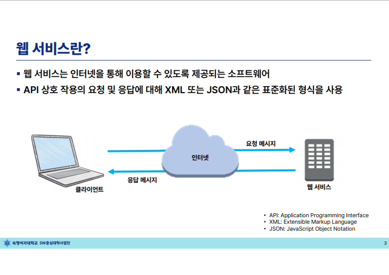
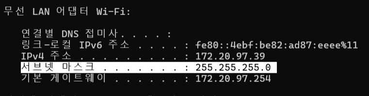

# AWS 글로벌 인프라 및 격리된 VPC 네트워크 환경 구축

# 요약

## 1. 🔑 핵심 개념 정리

- **리전(Region):** AWS 서비스가 제공되는 독립된 지리적 영역으로, 지연 시간(Latency) 최소화, 비용, 규정 준수(Compliance)를 고려하여 서울 리전(`ap-northeast-2`)을 선택했습니다.
- **가용 영역(Availability Zone, AZ):** 하나의 리전 내에서 무정전 전원 공급 장치(UPS)와 냉각 시설을 갖춘 독립된 데이터 센터 군집으로, 물리적 재해로부터 고가용성을 확보하는 기본 단위입니다.
- **CIDR (Classless Inter-Domain Routing):** IP 주소를 할당하고 라우팅하는 표기 방식으로, 사설 네트워크 대역의 크기를 유연하게 조정하는 데 사용됩니다.

---

## 🖥️ 2. VPC 및 서브넷 네트워크 설계 사양

실습에서 실제 설계하고 매핑한 사설 가상 네트워크 대역과 라우팅 테이블 구조입니다.

### 📡 IP 주소 대역 정의

- **VPC 내부 전체 CIDR:** `10.0.0.0/16` (총 65,536개 IP 확보 가능)
    - **Public Subnet 대역:** `10.0.1.0/24` (외부 인터넷과 직접 양방향 통신 가능)
    - **Private Subnet 대역:** `10.0.2.0/24` (외부 노출 없이 내부망으로만 격리)

### 🗺️ 라우팅 테이블(Route Table) 설정 사양

#### ① Public Subnet 라우팅 테이블

인터넷 게이트웨이(IGW)를 향하는 라우팅 경로가 포함되어 있어 외부 인터넷과 패킷을 주고받을 수 있습니다.

- `10.0.0.0/16` ➡️ `local` (VPC 내부 통신)
- `0.0.0.0/0` ➡️ `igw-xxxxxx` (인터넷 게이트웨이로 향하는 모든 외부 트래픽)

#### ② Private Subnet 라우팅 테이블 (vm01 인스턴스 소속)

인터넷 게이트웨이 경로를 차단하여 외부 접근을 차단하되, 패치 및 업데이트를 위한 단방향 나가는 트래픽을 위해 **NAT 게이트웨이**를 연결했습니다.

- `10.0.0.0/16` ➡️ `local` (VPC 내부 통신)
- `0.0.0.0/0` ➡️ `nat-xxxxxx` (NAT 게이트웨이로 향하는 아웃바운드 통신 전용)

---

## 🛠️ 3. 실습 핵심 가이드 및 검증

### 📌 NAT 게이트웨이(NAT Gateway)가 한 일

1. Private Subnet에 위치한 가상 머신 `vm01`은 외부에서 직접 접속할 수 없어 안전합니다.
2. 하지만 `vm01`에서 내부 패키지 업데이트(예: `sudo yum update` 등)를 수행해야 할 때, 인터넷과의 통신이 필요합니다.
3. 이때 **NAT 게이트웨이**가 `vm01`의 사설 IP 주소를 자신의 퍼블릭 IP 주소로 변환(Static NAT)하여 외부 인터넷으로 요청을 내보내고 결과만 받아와 안전한 아웃바운드 환경을 보장해 줍니다.

---

# 수업 내용

## 1. AWS 및 클라우드 기초 개념

- **웹 서비스(Web Service)의 의미**
    - AWS(Amazon Web Services)는 인터넷(웹)을 통해 인프라를 생성하고 관리할 수 있는 소프트웨어 및 플랫폼을 제공함.
    - 가입한 고객별로 자그마한 웹 서버(관리 콘솔 GUI)를 제공하여 개인 인프라를 구축할 수 있게 함.
- **IT 자원을 거래하는 플랫폼**
    - 물리적으로만 존재하던 서버, 네트워크, 스토리지를 **가상화**하여 고객에게 공급하는 플랫폼 기업.
- **클라우드의 핵심 특징**
    - **유연성 (Flexibility):** 컴퓨터의 파일/디렉터리를 다루듯 자원의 확장·축소가 매우 용이함 (예: 특정 기간만 메모리를 16GB $\rightarrow$ 32GB로 업그레이드 후 다운그레이드 가능).
    - **종량제 비용 (Pay-As-You-Go):** 사용한 만큼만 지불하는 방식. 안 쓰는 리소스를 빠르게 정리하면 비용 최적화 가능.
    - **빌딩 블록 (Building Blocks) 구조:** 레고 블록을 쌓듯 인프라 서비스들이 유기적으로 연결됨.

> 💡 **현업의 인프라 구축 트렌드: IaC (Infrastructure as Code)**
> 
> - 콘솔(GUI)을 통한 스텝 바이 스텝 구축은 복제(미국, 일본 리전 등)가 어려움.
> - 따라서 현업에서는 **스크립트 코드(테라폼, 앤서블 등)** 형태로 인프라를 구축하고 복제하는 방식을 주로 사용함.
> - 인프라 생성 시 구조적으로 차곡차곡 쌓이기 때문에 **스택(Stack)** 구조를 띠며, 삭제할 때는 반드시 **생성한 역순(마지막에 올린 자원부터)**으로 지워야 함.
> - 이러한 클라우드 인프라의 설계 모양을 **아키텍처(Architecture)**라고 하며, 대표적인 자격증으로 SAA(Solutions Architect Associate)가 있음.

## 2. AWS 글로벌 인프라 구조

### 🌐 리전 (Region)

- **정의:** 전 세계 데이터 센터들을 묶어 관리하는 가장 큰 지리적 단위 (통상 국가별로 위치, 큰 나라는 여러 개 존재).
- **특징:** AWS의 새로운 기능 배포나 자원 생성 시 가장 먼저 선택해야 하는 기준.
- **데이터 복제 규칙:** * 단일 리전 내의 데이터(예: S3 스토리지)는 디폴트로 3중화(복제)되어 안전하게 저장됨.
    - 하지만 **리전 간(지역 간) 데이터 복제는 고객이 직접 컨트롤**해야 함.
- **백본 네트워크 (Backbone Network):** 전 세계 데이터 센터들을 인터넷망이 아닌, 글로벌 기업(AWS, 구글, MS 등)이 자체 구축한 광케이블/해저케이블 전용망으로 연결하여 리전 간 초고속 통신을 지원함.

### 🏢 가용 영역 (AZ, Availability Zone)

- **정의:** 하나의 리전 안에 존재하는 하위 개념으로, **지리적으로 격리되되 고속 네트워크로 연결된 데이터 센터들의 묶음**.
- **특징:** 사용자는 실제 물리적 데이터 센터를 직접 식별할 수 없으므로, **AZ를 하나의 데이터 센터처럼 생각하고 사용**하면 됨.
- **이중화 구조:** 하나의 AZ는 장애 대비를 위해 실제 물리 데이터 센터 2개 이상으로 구성되며, 전원 및 냉각 장치가 모두 이중화되어 있음.
- **서울 리전 특징:** 2016년 개소 (현재 10주년), 총 4개의 가용 영역(AZ)을 보유 중.
    - *리전 및 AZ 명명 규칙:* 리전 이름 뒤에 abc를 붙임 (예: `eu-west-1a`, `eu-west-1b`).

### 📌 리전 선택의 4가지 고려 사항

1. **데이터 거버넌스 및 법적 요구사항 (데이터 주권):** 국가별로 중요한 데이터는 자국 내 데이터 센터에 저장해야 하는 법적 규칙을 준수해야 함.
2. **고객 근접성 (지연 시간 - Latency):** 웹사이트 이용자가 한국 사람이라면 서울 리전을 선택하는 것이 지연 시간을 최소화하는 방법임.
3. **리전별 사용 가능 서비스:** 최신 서비스는 미국 리전에 가장 먼저 배포되며, 리전마다 제공되는 서비스의 종류가 다를 수 있음.
4. **비용:** 리전이 위치한 국가의 전기세, 부동산 비용, 인건비 등이 반영되므로 리전마다 서버 사용 비용이 다름.

## 3. POP (Points of Presence) 및 캐시 서버

- **정의:** AWS의 리전이나 AZ 단위에 포함되지는 않지만, 데이터 센터 간의 원거리 공백을 메워주는 소규모 글로벌 인프라 시설. (주로 현지 통신사 데이터 센터를 렌트하여 사용).
- **주요 역할:** **캐시(Cache) 서버** 역할을 하여 전 세계 사용자에게 콘텐츠를 빠르게 전송 (네트워크 단원의 **CloudFront** 서비스와 연계됨).
- **종류:**
    - **엣지 로케이션 (Edge Location):** 재사용성이 높은(자주 액세스하는) 콘텐츠를 근접 공간에 임시 저장. (배포 숫자가 가장 많음).
    - **리전별 엣지 캐시 (Regional Edge Cache):** 엣지 로케이션보다 규모가 크고 조금 더 재사용성이 떨어지는 데이터를 캐싱.
- **기타 특징:** 데이터 센터의 고질적인 발열 문제를 해결하기 위해 최근에는 극지방이나 해저 데이터 센터 구축을 기획하는 등 ESG 경영(태양열, 풍력 발전 자가 공급)을 시도하는 추세임.

## 4. AWS 서비스 범주 (Category)

> 💡 **초보자 팁:** 인프라 서비스를 찾을 때 단순히 검색하는 것보다 **범주(Category)**를 통해 접근하면 해당 서비스가 어떤 계열의 기능을 하는지 파악하기 훨씬 쉽습니다.
> 
- **기초 서비스 (Infrastructure Layer) 🌟 *이번 과정의 핵심***
    - **컴퓨팅 (Compute):** 가상 머신 서비스인 **EC2** (2006년 AWS 런칭 멤버, 목적에 따라 CPU형, 메모리형, GPU형 등 인스턴스 유형 선택 가능).
    - **네트워크 (Networking):** 가상 가상 네트워크 환경을 만드는 **VPC** (네트워킹 및 콘텐츠 전송 범주에 속하며, 실습의 첫 단계).
    - **스토리지 (Storage):** 오브젝트 스토리지인 **S3** (EC2와 함께 최초 런칭된 핵심 스토리지).
    - **보안 및 자격 증명:** 권한 관리를 위한 **IAM**.
- **플랫폼 서비스 (Platform Layer):** 데이터베이스(DB), 분석, 애플리케이션 배포 및 관리 도구, 모바일 서비스 등.
- **애플리케이션 서비스 (Application Layer):** 팬데믹 이후 비대면 근무를 위한 가상 데스크톱 환경, 협업 플랫폼 등 완전한 소프트웨어 형태의 서비스.

---

## 1. 네트워크 및 IP 기초 개념

### 🌐 공유기와 서브넷 (Subnet)

- **사설 IP 할당:** 와이파이(공유기)에 연결하는 순간, 장치는 공유기로부터 내부적으로 관리 가능한 **사설 IP**를 부여받음.
- **서브넷(Subnet):** 같은 공유기 주소 공간을 공유하여 프린터, IoT 가전 등 디바이스끼리 내부 통신이 가능해진 가상 환경.
- **라우터(Router):** 서로 다른 서브넷이나 네트워크 간에 통신 규칙을 지정하여 데이터를 중계해 주는 장비. 클라우드에서도 여러 서브넷을 연결하려면 라우터가 필수적임.

### 🔢 IP 주소 체계와 CIDR (사이더) 방식

- **IPv4 주소:** 4개의 숫자 조합(예: `192.168.0.1`)으로, 각 자리는 8비트(0~255) 단위임. 총 32비트 체계로 약 40억 개의 주소 표현 가능.
- **CIDR (Classless Inter-Domain Routing):** IP 주소 뒤에 슬래시(`/`)와 숫자를 붙여 서브넷의 크기를 표현하는 방식.
    - 기존 컴퓨터 환경(예: `ipconfig` 명령 시)에서는 **IP 주소**와 **서브넷 마스크**를 두 줄로 따로 보여주지만, **클라우드에서는 이를 한 줄로 축약한 CIDR 방식을 표준으로 사용함**.
    - 예: `192.168.0.0/24` $\rightarrow$ 앞의 24비트(3자리)까지는 네트워크 주소로 고정하고, 나머지 8비트(마지막 1자리)로 256개의 IP 주소 공간을 가짐.

## 2. 공인 IP, 사설 IP, 그리고 NAT 기술

- **공인 IP (Public IP):** 전 세계 인터넷망에서 유일한 주소. 외부에서 내 컴퓨터를 찾아올 수 있게 함.
- **사설 IP (Private IP):** 보안 및 IP 부족 해결을 위해 내부 망에서만 사용하는 주소 (예: `10.x.x.x`, `172.16.x.x`, `192.168.x.x` 대역).
    - **NAT (Network Address Translation):** 사설 IP를 사용하는 장치가 인터넷(구글, 네이버 등)에 나갈 때, 공유기의 공인 IP로 주소를 변환하여 통신할 수 있게 하는 핵심 기술. 외부에서는 공유기의 공인 IP만 식별되므로 내부 자원의 보안이 강화됨.

## 3. OSI 7계층 모델과 로드 밸런서 (Load Balancer)

- **OSI 7계층:** 네트워크 통신 흐름을 설명하기 위한 이론적 모델.
- **클라우드 서비스 선택 시 활용 (중요):**
    - **L7 (애플리케이션 계층) 로드 밸런서:** HTTP/HTTPS 통신을 사용하는 웹사이트 부하 분산 시 적용 (예: AWS ALB).
    - **L4 (전송 계층) 로드 밸런서:** TCP/UDP 프로토콜단에서 정책에 따라 부하를 분산할 때 적용 (예: AWS NLB).

## 4. Amazon VPC (Virtual Private Cloud) 구조 및 설계

### 🏢 VPC와 서브넷의 특징

- **VPC 정의:** AWS라는 공용 공간 안에 논리적으로 격리 구축하는 **나만의 가상 네트워크 환경**. 리전(Region)에 귀속됨 (기본 할당량: 리전별 5개, 지원 센터를 통해 증설 요청 가능).
- **서브넷 생성:** VPC 내부를 쪼갤 때 사용하며, **가용 영역(AZ)을 지정**하면서 생성함. 지리적 장애 극복을 위해 최소 2개 이상의 서로 다른 AZ에 분산 배치하는 것이 안전함.

### ⚠️ AWS 서브넷 설계 시 주의 사항

1. **수정 불가:** VPC는 한 번 만들면 IP 주소 대역의 크기 변경이 불가능함. 부족할 경우 인프라를 새로 구축해야 하므로 **처음부터 크게(예: `/16`) 설계하는 것을 권장**. (특히 컨테이너 환경은 IP 소진율이 급격히 증가함).
2. **예약 IP (5개 사용 불가):** CIDR 대역이 `/24` 일 때, 계산상 256개 중 **5개 주소는 AWS가 내부 용도로 사전 예약**하여 사용자가 쓸 수 없음 (`.0` 네트워크, `.1` 게이트웨이, `.2` DNS 서버, `.3` 미래 예약, `.255` 브로드캐스트).

### 🌐 공인 IP 할당 및 VPC 피어링 (Peering)

- **탄력적 IP (Elastic IP):** 일반적인 퍼블릭 IP는 서버를 재시작하면 주소가 바뀌지만, 고정된 공인 IP가 필요할 경우 돈을 지불하고 구매하여 가상 서버에 유연하게 탈부착하며 사용하는 고정 IP 기술.
- **VPC 피어링:** 같은 계정 내 2개 이상의 VPC 간에 **인터넷을 거치지 않고 내부 사설망**으로 초고속 통신을 연결하는 기술.
    - **🚨 필수 규칙:** 피어링할 두 VPC의 **IP 주소 대역(CIDR)이 겹치면(충돌 발생) 피어링을 맺을 수 없음**. 따라서 여러 VPC 생성 시 주소 대역을 다르게 설계해야 함.

---

## 1. 퍼블릭 서브넷(DMZ) vs 프라이빗 서브넷

- **퍼블릭 서브넷 (DMZ 서브넷):** 인터넷과 사설(프라이빗)망 사이에 위치하는 완충지대 역할을 함. 외부 인터넷망과 양방향(Inbound / Outbound) 통신이 모두 가능함.
- **프라이빗 서브넷:** 외부 인터넷과 완전히 격리되어 보안 상태가 매우 높은 영역. 외부에서 직접 접근할 수 없으며 기본적으로 내부망 간의 통신만 가능함.
- **인터넷 아웃바운드(Outbound)의 필요성:** 프라이빗 서브넷의 서버라 하더라도 OS 업데이트나 외부 라이브러리(패키지) 다운로드를 위해 '나가는 통신'은 허용되어야 함. (인터넷 게이트웨이는 양방향 통신이므로 프라이빗 환경을 위해 추후 NAT 게이트웨이 등의 별도 구성을 적용함).

## 2. AWS 네트워크 및 인프라 구축 실습 과정

### 🏗️ Step 1. VPC 및 서브넷 기본 인프라 생성

1. **기본(Default) VPC 삭제:** 클라우드 콘솔 진입 장벽을 낮추기 위해 사전 제공되는 기본 VPC는 실습 혼선을 방지하기 위해 삭제 처리함.
2. **VPC 생성:** `마이 VPC` 생성 (CIDR 대역: $10.0.0.0/16$ 방식의 최대 대역).
3. **서브넷 2개 생성:**
    - `마이 서브 01`: 가용영역(AZ) **서울 A 존**, IP 대역 $10.0.1.0/24$
    - `마이 서브 02`: 가용영역(AZ) **서울 C 존**, IP 대역 $10.0.2.0/24$

### 🔒 Step 2. 보안 그룹(방화벽) 설정 (`마이 웹 SG`)

서버 인스턴스 각각에 붙여서 사용할 컴퓨터 수준의 소프트웨어 방화벽을 구성함. 인바운드(들어오는 규칙)는 허용 목록(Allow-list) 기반으로 필요한 3가지 규칙을 수동 추가함.

- **아웃바운드 규칙:** 모든 트래픽($0.0.0.0/0$) 기본 허용.

| **유형** | **포트 번호** | **소스 (접근 허용 대역)** | **용도** |
| --- | --- | --- | --- |
| **SSH** | `22` | 애니웨어 ($0.0.0.0/0$) | 리눅스 서버 원격 관리 접속용 |
| **HTTP** | `80` | 애니웨어 ($0.0.0.0/0$) | 웹 서버 서비스 제공용 |
| **모든 ICMP IPv4** | N/A | 애니웨어 ($0.0.0.0/0$) | 네트워크 연결 확인용 (Ping 테스트) |

### 🧭 Step 3. 인터넷 게이트웨이 및 라우팅 테이블 연결 (퍼블릭 전환)

1. **인터넷 게이트웨이(`마이 igw`) 생성:** VPC의 대문 역할을 수행하도록 생성 후 `마이 VPC`에 연결(Attach).
2. **사용자 정의 라우팅 테이블(`마이 라우팅`) 생성:**
    - 내부 통신을 위한 기본 `Local` 규칙 외에, 외부 인터넷으로 향하는 모든 트래픽($0.0.0.0/0$)을 외부 대문인 **인터넷 게이트웨이(`마이 igw`)로 던지도록 라우팅 규칙 추가**.
3. **서브넷 연결 편집:** `마이 라우팅` 테이블에 **`마이 서브 01`만 명시적으로 연결**.
    - 결과적으로 1번 서브넷은 외부 통신 경로가 확보된 '퍼블릭 서브넷'이 되고, 연결되지 않은 2번 서브넷은 '프라이빗 서브넷'으로 고립됨 (VPC 리소스 맵에서 직관적으로 확인 가능).

## 3. EC2 가상 서버 인스턴스 생성 및 원격 접속 준비

### 🔑 키페어 (Key Pair) 생성

- 클라우드 리눅스 서버는 ID/비밀번호 방식 대신 보안성이 매우 높은 비대칭키 방식을 필수 사용함.
- `마이 키` 생성 시 로컬 PC에 `.pem` 파일이 다운로드되며, 서버를 생성할 때 복사본 키가 주입되어 두 쌍이 일치해야 원격 로그인이 허용됨.

### 💻 EC2 인스턴스 2대 생성 사양

| **인스턴스 이름** | **운영체제 (AMI)** | **인스턴스 유형 (스펙)** | **배치 서브넷 위치** | **퍼블릭 IP 자동 할당** | **적용 보안 그룹** |
| --- | --- | --- | --- | --- | --- |
| **VM 01** | 아마존 리눅스 2023 | `t3.micro` (vCPU 2, Mem 1GB) | `마이 서브 01` (퍼블릭) | **활성화 (Required)** | `마이 웹 SG` |
| **VM 02** | 아마존 리눅스 2023 | `t3.micro` (vCPU 2, Mem 1GB) | `마이 서브 02` (프라이빗) | 활성화 | `마이 웹 SG` |

### 🔌 OS별 원격 터미널 접속 환경 세팅

1. **Windows 환경 (MobaXterm 프로그램 활용):**
    - MobaXterm 설치 후 상단의 **[Session] $\rightarrow$ [SSH]** 선택.
    - Remote Host: **VM 01의 공인 IP (Public IP)** 입력.
    - Specify username 체크: **`ec2-user`** 입력 (아마존 리눅스의 표준 기본 관리자 계정 명칭).
    - 포트: `22` 설정 후 다운로드한 `.pem` 키페어를 연동하여 접속 시도.
2. **Mac 환경 (기본 터미널 내장 유닉스 셸 활용):**Bash
    - 다운로드받은 `.pem` 파일의 권한 설정이 너무 개방적이면 보안 정책상 접속이 거부됨.
    - 터미널을 실행한 뒤 파일이 존재하는 디렉토리(예: 다운로드 폴더)로 이동하여 **파일 권한을 소유자 전용으로 제한하는 명령어를 반드시 선행해야 함**.
    
    ```
    chmod 400 마이-키.pem
    ```
    

---



- **웹서비스** : 인프라를 생성하고 관리할 수 있는 소프트웨어


- **Cloud** : IT 자원을 이용하는 플랫폼
    - **유연성 제공:** 모든 것이 **가상화**
    - **유기적:** 레고 블록처럼 **stack** **쌓아서** 만듦
- **code로 Infra 만든다**
    - **Script**로 만드면 똑같이 복제 가능
    - **아키텍쳐 :** 인프라 설계

---

# 1. AWS 글로벌 인프라


- region : 클라우드에서 가장 큰 단위의 지리적 영역. 호주, 서울, 미국 등 region을 설정
    - 전세계의 데이터 센터를 연결 (백본 네트워크 인프라)


- 한 리전 안에서의 데이터 복제는 AWS가 하지만, **리전 간 데이터 복제는 고객이 제어**
- AWS 홈페이지에서 **리전 확인**
    - **Seoul 리전 가용영역** : 4개


# 리전 선택 시 고려 요인


- 리전 별로 **서버 비용**이 다름
    - But 주의 사례 : 도쿄 리전이 싸서 이용
        - 괜히 **트래픽 문제**로 지연 되기 가능.


---

# 가용영역

→ 가용Zone. **하나의 DataCenter 처럼 생각하고** 사용.

→ 실제 **물리적 DataCenter는 여러개**. (장애를 대비) **서로 응답 가능한 거리**끼리 묶어놓은게 가용영역.

서울은 4개.


---

# POP (상호 접속 위치)


- **리전과 리전 먼 거리를 매꿔주는** 작은 데이터 센터 같은 역할.
- **2가지** 종류 : **엣지 로케이션** > **엣지 캐시**
    - 둘다 **캐시** 서버 (자주 access 하는 것들을 넣어 접근성 높임)


---

# 2. AWS 서비스 범주 및 주요 서비스

- 이케아의 쇼룸 → 판매와 비슷함
    - 사이트의 **제품** 탭 = 브로셔, 쇼룸 같은 의미 ( EC2, VPC 등 하드웨어 CPU, GPU **적합한 서비스 추천**)


- 가상 데스크톱 : 회사에 있는 것처럼 일하게


---

# AWS Networking

### 1.네트워크


- 여러기기 간 각각의 IP주소를 가지고 소통 가능하게끔 하는 걸 **서브넷 → 와이파이를 통해 가능**
- 2개의 서브넷 사이에 **라우터(경로 지정)**가 있어야함


- 10진수 4자리이지만, 실제로는 8bit 2진수가 4개 → **32bit (IPv4)**
    - **c.f.** 2의 32제곱개가 부족해서 **IPv6가 나옴 → 128bit**

# CIDR 방식 - 0.0.0.0/0


- **서브넷 (네트워크 식별자) → 여기선 앞 3자리 = 24bit**
- **CIDR  블록크기** → 가장 마지막에 **서브넷** 즉 **고정 비트수**를 알려줌 (3자리므로 **24)**

## cmd - ipconfig


- 요즘은 이렇게 서브넷 마스크 이용 안하고 CIDR 사용.
- 기본 게이트 웨이 = 와이파이 정보 (가장 마지막 자리 보통 255 사용)


- **CIDR 블록크기(bit수)** 에 따른 전체 **IP주소수 = 2의 (32-블록bit수)제곱**

---


- **외부: 공인 IP** → 부족, 보안 문제.
- **내부: 사설 IP** 출두. → 망 안에 있는 자원끼리 (프린터 등) 소통할 때 사용.
    - **NAT(**Network Address Translation) : 네이버, 구글 외부 네트워크로, 밖으로 나갈때는 공인 IP로 , **네트워크 주소 변환 기술**
        - e.g.**(내부 사설 IP)** cmd 기본 게이트 웨이 주소 → (**외부 공인 IP)** 구글에 나오는 내 기기 주소




---

# 계층별 로드 밸런서 숫자


- 웹사이트 → HTTP 통신 → 애플리케이션 서버 **7개층의 로드 밸런서**

로드 밸런서(Load Balancer, 부하분산기)는 말 그대로 서버가 처리해야 할 **부하(Load)를 여러 대의 서버로 공평하게 나누어주는(Balance) 장치나 소프트웨어**를 말해요.

수업에서 VPC와 서브넷을 만들고 그 안에 여러 대의 가상 서버(VM 01, VM 02 등)를 구축한 이유가 바로 이 로드 밸런서를 사용하기 위한 빌드업이기도 합니다.

## 1. 로드 밸런서가 필요한 이유

만약 전 세계에서 수만 명의 사용자가 내가 만든 웹사이트에 접속하는데, 서버가 딱 한 대(`VM 01`)뿐이라면 어떻게 될까요?

- **서버 다운(Crash):** 처리 능력을 초과하는 트래픽이 몰리면 서버가 터져버립니다.
- **성능 저하:** 서버가 느려져서 사용자들은 무한 로딩을 겪게 됩니다.

그래서 보통 똑같은 사양의 서버를 여러 대(VM 01, VM 02, VM 03...) 만들어 둡니다. 하지만 사용자가 직접 *"나는 1번 서버로 갈래", "나는 2번 서버로 갈래"* 선택할 수는 없겠죠?

이때 **맨 앞에 로드 밸런서를 딱 세워두면, 사용자는 로드 밸런서 대표 주소(IP나 도메인) 하나로만 접속**하고, 로드 밸런서가 뒤에 있는 서버들의 상태를 보고 트래픽을 골고루 분배해 줍니다.

## 2. 핵심 기능 3가지

- **부하 분산 (Traffic Distribution):** 여러 대의 서버로 요청을 나누어 단일 서버의 과부하를 방지합니다.
- **상태 확인 (Health Check):** 로드 밸런서는 뒤에 있는 서버들이 살아있는지 주기적으로 핑(Ping)을 날리거나 통신을 시도해 봅니다. 만약 `VM 02`가 고장 나서 응답이 없으면, **정상인 서버(`VM 01`)로만 트래픽을 보내는 똑똑한 기능**을 합니다.
- **고가용성 (High Availability) 확보:** 한두 대의 서버가 장애로 죽더라도 서비스는 멈추지 않고 중단 없이 계속 운영(무중단 서비스)될 수 있게 만듭니다.

## 3. AWS의 로드 밸런서 (ELB: Elastic Load Balancing)

AWS에서는 이 기능을 **ELB**라는 서비스로 제공하며, 크게 3가지 종류가 있습니다. 면접이나 자격증 시험에서도 단골로 나오는 개념이에요.

| **종류** | **작동 계층 (OSI 7 Layer)** | **주요 특징 및 용도** |
| --- | --- | --- |
| **ALB** (Application Load Balancer) | **7계층 (Application)** | **HTTP, HTTPS** 트래픽 처리에 특화. URL 주소 경로(예: `/images`는 이미지 서버로, `/api`는 API 서버로)나 쿠키를 보고 똑똑하게 분기해 주는 **웹 애플리케이션 전용** 로드 밸런서. |
| **NLB** (Network Load Balancer) | **4계층 (Transport)** | **TCP, UDP** 프로토콜 처리. 할당된 고정 IP를 가질 수 있으며, 초당 수백만 개의 요청을 처리할 수 있을 정도로 **속도가 매우 빠르고 대용량 트래픽**에 적합. |
| **CLB** (Classic Load Balancer) | 4/7계층 혼합 | 예전에 쓰던 구형 로드 밸런서 (현재는 거의 사용하지 않음). |

## 4. 네트워크 구성에서의 위치 (VPC 관점)

네트워크 아키텍처를 설계할 때 보통 로드 밸런서는 외부 인터넷과 직접 닿아야 하므로 **퍼블릭 서브넷**에 위치시킵니다.

반면, 실제 소스 코드가 돌아가는 웹 서버나 데이터베이스(DB) 서버들은 보안을 위해 외부에서 직접 들어올 수 없는 **프라이빗 서브넷**에 꽁꽁 숨겨둠. 사용자는 `인터넷 $\rightarrow$ 퍼블릭의 로드 밸런서 $\rightarrow$ 프라이빗의 웹 서버` 경로로 안전하게 접속하게 됩니다.

---

# 2. Amazon VPC

Virtual Private Cloud

- 실제 **물리적 환경**과 달리 **논리적으로 격리된 공간**을 만듦


- **리전>VPC**는 리전에 소속.
    - **2개의 리전에서 VPC 사용 불가.**


---


> AWS  클라우드 > 리전 > **VPC > 가용존 > 서브넷**
> 


- 왜 IP주소 **251개**? → **5개는 예약**됨.

# 공인 IP 주소 할당방식 2가지


- **스카 자유석과 고정석 생각.**


- **피어링 :** 2개의 VPC를 하나의 네트워크처럼 사용 을 위해서 **CIDR 블록(네트워크 주소 크기)는 서로 다르게 !!중첩되지 않게 !!!**

---