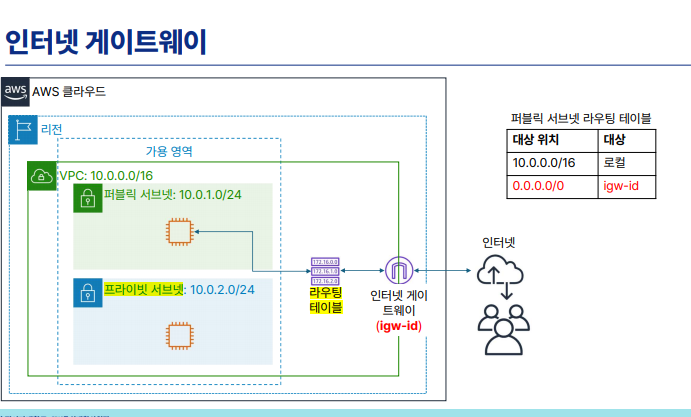

# 2_VPC_Security_nACL_SG

# 🛡️ VPC 다중 방어 계층 설계: 보안 그룹(SG) 및 네트워크 ACL(nACL)

# 요약

## 1. 🔒 다중 방어 계층 아키텍처 개요

클라우드 인프라의 보안을 강화하기 위해 서브넷 관문을 지키는 **Stateless 방화벽(nACL)**과 각 가상 머신(EC2) 바로 앞을 지키는 **Stateful 방화벽(Security Group)**을 연계한 이중 네트워크 보안 환경을 구축하고 트래픽 흐름을 제어했습니다.

---

## 🚦 2. 인바운드(Inbound) 및 아웃바운드(Outbound) 트래픽 흐름 제어

### 🛡️ 2.1 보안 그룹 (Security Group) 설정

Private Subnet 내 가상 머신을 보호하기 위한 `my-private-sg` 보안 그룹 설정 흐름입니다.

#### 📥 인바운드 규칙 (안으로 들어오는 신호)

외부에서 원격 제어 및 웹 서빙을 할 수 있도록 필요한 포트만 화이트리스트로 명시하여 허용했습니다.

- **SSH (22번 포트):** 지정된 관리자 IP 대역(또는 bastion 호스트 IP)만 허용하여 불법적인 CLI 접근 통제
- **HTTP (80번 포트):** `0.0.0.0/0` 또는 로드 밸런서 대역을 허용하여 웹 트래픽 진입 허용

#### 📤 아웃바운드 규칙 (밖으로 나가는 신호)

- `0.0.0.0/0` (모든 트래픽 기본 허용)
- 💡 **Stateful 특징 실습 검증:** 인바운드 규칙에서 22번이나 80번 포트가 허용되어 트래픽이 정상적으로 들어왔다면, 아웃바운드 규칙에서 해당 포트를 별도로 열어주지 않더라도 **나가는 응답 신호는 AWS가 기억하고 자동으로 통과**시키는 메커니즘을 확인했습니다.

---

### 🧱 2.2 네트워크 ACL (Network ACL) 설정

서브넷 단위의 관문 역할을 하며, 보안 그룹과 달리 **차단(Deny) 규칙**을 명시적으로 제어하는 실습을 진행했습니다.

#### 📑 서브넷 레벨 트래픽 필터링 (Stateless 규칙)

- nACL은 규칙 번호가 낮은 순서(예: 100 ➡️ 200)대로 엄격하게 순차 적용됩니다.
- **차단 시나리오 실습:** 특정 유해 IP 대역이나 공격 의심 대역의 트래픽을 원천 차단하기 위해, 규칙 번호 `50`번에 `소스 IP/대역 -> ALL Traffic -> DENY` 규칙을 삽입하여 하위 허용 규칙(예: 100번 ALL ALLOW)보다 우선적으로 트래픽이 드롭(Drop)되는 구조를 검증했습니다.
- 💡 **Stateless 특징 실습 검증:** 보안 그룹과 달리 nACL은 신호를 기억하지 못하므로, 들어오는 문(`Inbound`)을 열었더라도 나가는 문(`Outbound`)에 대응하는 임시 포트(Ephemeral Ports, 보통 1024-65535) 규칙이 허용되어 있지 않으면 양방향 통신이 끊어지는 구조적 특성을 체득했습니다.

---

## 💡 3. 실무 중심 보안 아키텍처 결론

- **보안 그룹**은 백엔드 애플리케이션 인스턴스의 촘촘한 포트 제어(허용 기반)에 사용하며,
- **네트워크 ACL**은 인프라 전체 망 레벨에서 특정 대역을 대규모로 차단하거나 허용하는 서브넷 울타리 역할로 이중 결합할 때 비로소 안전한 클라우드 아키텍처가 완성됨을 확인했습니다.

---

# 수업 내용

## 🛡️ 1. AWS 다중 방어 계층 (VPC 방화벽 3대장)

AWS는 비용과 보안 요구사항에 따라 인프라를 겹겹이 감싸는 **다중 방어 계층(Multi-layered Security)** 구조를 가집니다. 방화벽 간에는 `OR` 연산이 없으며, 무조건 `AND` 구조(모든 방화벽을 통과해야 서버에 도달)로 작동합니다.

| **방화벽 종류** | **적용 범위** | **특징 및 실무 활용** | **비용** |
| --- | --- | --- | --- |
| **Network Firewall** | **VPC 전체** | 물리 방화벽과 가장 유사함. 기업 전체 네트워크를 보호할 때 메인으로 선택함. | **유료** |
| **네트워크 ACL (NACL)** | **서브넷 단위** | 기본적으로 모든 트래픽 허용 상태(`Allow All`). 우선순위(규칙 번호)가 있고 `Deny`(거부)가 가능하여, **특정 악성 IP 대역을 차단(입구 컷)**하는 블랙리스트 용도로 주로 씀. | 무료 (기본 제공) |
| **보안 그룹 (SG)** | **인스턴스(VM) 단위** | OS 소프트웨어 방화벽과 유사함. `Allow`(허용)만 정의 가능하며 우선순위가 없음. 실무에서 가장 빈번하게 제어함. | 무료 (기본 제공) |

> 💡 **금융·공공·의료 도메인 지식:** 해외 클라우드(AWS, Azure)와 달리 국내 공공기관이나 금융권은 보안 규정 준수(Compliance)가 매우 까다로워 가상 방화벽 외에 실제 '물리 방화벽 장비' 연동을 요구하는 경우가 많습니다. 이 때문에 국내 공공 사업은 KT 클라우드나 네이버 클라우드(NCP)가 시장을 꽉 잡고 있습니다.
> 

## 💻 2. AWS 컴퓨팅(EC2) 및 스토리지 엔진 구조

### ① 다양한 컴퓨팅 옵션의 스펙트럼

- **IaaS (인프라 제어 위주):** `EC2` (가상 머신 개발 환경을 직접 제어) $\rightarrow$ 가상화 기술의 핵심인 하이퍼바이저(Hypervisor)가 물리 자원(CPU, 메모리)을 쪼개서 가상 머신들에게 분배함.
- **컨테이너 가상화:** `ECS`, `EKS` (Docker 컨테이너 기반 환경)
- **PaaS (개발자 친화형):** `Elastic Beanstalk` (자바/스프링 등 플랫폼 테마를 선택하면 알아서 서버 환경을 세팅해 줌)
- **서버리스(Serverless):** `Lambda` (사용자가 관리할 서버가 없음. 하루 5분만 도는 배치 스크립트처럼 **'실행된 시간'에 대해서만 비용을 지불**하므로 매우 경제적. 타사에서는 `Function`이라 부름)

### ② EC2 인스턴스 이름의 비밀 (`t3.micro`, `c5.large` 등)

- **인스턴스 패밀리(맨 앞 알파벳):** 서버의 용도를 결정합니다.
    - `T`, `M`: 범용 (일반적인 웹 서버, 백엔드 애플리케이션)
    - `C`: Compute 최적화 (CPU 성능 중요, 연산 위주)
    - `R`, `X`: Memory 최적화 (데이터베이스, 캐시 서버)
    - `G`, `P`: 가속 컴퓨팅 (GPU 탑재, AI 및 딥러닝 인공지능 분석)
- **세대 번호(가운데 숫자):** 숫자가 높을수록 최신 사양이자 가성비가 좋은 장비입니다.
- **사이즈(맨 뒤 서픽스):** `nano` < `micro` < `small` < `medium` < `large` 순으로 의류 사이즈처럼 스펙(vCPU, RAM)이 배로 커집니다.

### ③ 휘발성 vs 영구 보존 스토리지

- **인스턴스 스토어 (Instance Store):** 호스트 물리 머신에 직접 붙어 있는 로컬 스토리지입니다. 속도는 빠르나 서버를 중지(Stop)하면 데이터가 영구히 소실되는 **임시/휘발성 스토리지**입니다.
- **EBS (Elastic Block Store):** 네트워크로 연결된 별도의 하드디스크입니다. 서버를 꺼두어도 내 소중한 데이터가 영구히 보존됩니다.
    - **비용 팁:** 서버를 중지(Stop)하면 CPU, 메모리, IP 사용료는 반납되어 돈이 안 나가지만, **EBS 스토리지 점유 비용은 서버가 꺼져 있어도 계속 청구**됩니다.

## 🛠️ 3. 기타 핵심 인프라 관리 요소

- **네트워크 인터페이스 (ENI):** 가상 가상 머신에 장착되는 가상 랭카드입니다. 컴퓨터는 한 대지만 목적(외부 인터넷용, 내부 로컬 통신용)에 따라 랭카드를 여러 개 꽂아 보안 그룹을 다르게 묶을 수 있습니다.
- **사용자 데이터 (User Data):** 서버가 생성된 직후 자동으로 실행될 쉘 스크립트(`Nginx 설치` 등)를 지정하여 서버 부팅과 동시에 초기 세팅을 자동화하는 기능입니다.
- **태그 (Tag):** 인스타그램 해시태그처럼 자원에 메타데이터를 심어, 추후 프로젝트별/개발자별로 비용을 추적하거나 자원을 필터링할 때 유용하게 씁니다.
- **CloudWatch & SNS:** 시스템의 CPU 사용률 등을 모니터링(`CloudWatch`)하다가 경고가 뜨면 심플 알림 서비스(`SNS`)를 통해 관리자 메일이나 핸드폰 앱 푸시로 장애 경보를 날려줍니다.

## [실습] 프라이빗 가상 서버 접속 및 **NAT 게이트웨이**

AWS 환경에서 **베스천 호스트(Bastion Host)를 이용해 프라이빗 가상 서버에 접속하는 실습**과, 프라이빗 서버의 인터넷 통신을 위한 **NAT 게이트웨이 실습**, 그리고 실습 종료 후 **비용 방지를 위한 자원 정리**까지의 전 과정

## 1단계: 실습 전 AWS VPC 기본 설정 변경

실습을 매끄럽게 진행하기 위해 VPC의 기본 속성을 변경합니다.

- **작업 내용:** 사용 중인 VPC(`my VPC`)의 설정 편집 메뉴로 이동합니다.
- **변경 사항:** 기존에 활성화되어 있던 **[DNS 확인 활성화]** 외에, **[DNS 호스트 이름 활성화]** 옵션을 추가로 체크하고 저장합니다. (향후 실습에서 지속적으로 사용될 핵심 설정입니다.)
- **작업 환경 세팅:** 효율적인 실습을 위해 웹 브라우저에 **EC2 인스턴스 페이지**와 **VPC 페이지**를 각각 새 탭으로 띄워두고 진행합니다.

## 2단계: 프라이빗 보안 그룹(SG) 생성 및 서버 적용

보안 강화를 위해 프라이빗 서브넷 전용 방화벽 규칙을 수립하고 서버에 바인딩합니다.

- **보안 그룹 생성:** `my-private-SG`라는 이름으로 새 보안 그룹을 생성합니다.
- **인바운드 규칙 제한 (보안의 핵심):** * 모든 IP(`0.0.0.0/0`)를 허용하던 기존과 달리, 오직 **1번 서버(`VM 01`, 베스천 호스트)의 프라이빗 IP 1대만 허용**하도록 제한합니다.
    - 규칙 추가 시 IP 뒤에 단일 호스트를 뜻하는 사이더(CIDR) 값인 `/32`를 명시합니다. (`프라이빗_IP/32`)
    - **허용 프로토콜:** 관리용 `SSH(22번)` 규칙과 테스트용 `모든 ICMP IPv4(Ping)` 규칙을 각각 추가합니다. (만약 대상 서버가 DB 서버라면 `MySQL(3306)` 같은 규칙을 추후 추가해야 합니다.)
- **서버 적용:** 2번 서버(`VM 02`)의 보안 설정으로 이동하여, 기존의 모든 대역 허용 보안 그룹(`my 웹 SG`)을 **제거**하고 새로 만든 `my-private-SG`를 추가(연결)합니다.

## 3단계: 베스천 호스트를 통한 프라이빗 서버 원격 접속

내 PC에서 직접 접근할 수 없는 2번 서버에 1번 서버를 징검다리 삼아 접속합니다.

- **키페어 업로드:** 2번 서버에 접속하려면 개인 키(`.pem`)가 필요하지만 프라이빗 서버 내부에는 존재하지 않으므로 내 로컬 PC의 키를 1번 서버로 전달합니다.
    - **Windows (MobaXterm):** 로컬 탐색기에서 `.pem` 파일을 MobaXterm 터미널 창으로 드래그 앤 드롭하여 간편하게 업로드합니다.
    - **Mac:** 터미널에서 `SCP` 명령어를 사용하여 1번 서버의 홈 디렉터리로 키를 전송합니다.Bash
        
        ```
        scp -i 마이-키.pem 마이-키.pem ec2-user@VM01공인IP:~
        ```
        
- **키 권한 변경 (필수):** 1번 서버 내부로 전달된 키 파일의 권한을 엄격하게 제한하지 않으면 SSH 접속이 거부되므로 권한을 수정합니다.Bash
    
    ```
    chmod 600 마이-키.pem
    ```
    
- **최종 SSH 터널링 접속:** 1번 서버 터미널 안에서 2번 서버의 **사설(프라이빗) IP**를 이용하여 SSH 접속을 수행합니다. 핑거프린트 확인 시 `yes`를 입력하면 내부망을 통해 2번 서버에 성공적으로 안착하게 됩니다.

## 4단계: NAT 게이트웨이를 이용한 아웃바운드 인터넷 연결

프라이빗 서버는 외부에서 들어오는 것은 막혀있지만, 패치나 업데이트를 위해 밖으로 나가는 통신(아웃바운드)은 가능해야 하므로 NAT 게이트웨이를 구성합니다.

- **현상 확인:** 2번 서버 접속 후 구글 DNS 주소로 핑 테스트(`ping -c 5 8.8.8.8`)를 해보면 응답이 오지 않고 실패합니다.
- **NAT 게이트웨이 생성:** * 이름은 `my-NAT-GW`로 지정하며, 외부와 통신해야 하므로 반드시 퍼블릭 서브넷(1번 서브넷)에 생성해야 합니다.
    - 통신을 중재할 외부 공인 IP가 필요하므로 **[탄력적 IP 할당]** 버튼을 눌러 공인 IP를 즉석에서 주입합니다.
- **프라이빗 라우팅 테이블 구성 및 연결:**
    - 새 라우팅 테이블 `my-NG-route`를 생성합니다.
    - **라우팅 규칙 추가:** 외부 인터넷 대역(`0.0.0.0/0`)으로 향하는 대상(Target)을 방금 만든 나트 게이트웨이(`my-NAT-GW`)로 지정합니다.
    - **서브넷 연결:** 이 설정을 **2번 프라이빗 서브넷**에 명시적으로 연결합니다.
- **최종 확인:** VPC 리소스 맵에서 프라이빗 서브넷이 NAT 게이트웨이를 거쳐 인터넷으로 나가는 단방향 경로(밖에서는 못 밀고 들어오고 안에서는 나갈 수 있는 문)를 확인한 후, 다시 2번 서버에서 `ping 8.8.8.8`을 날리면 정상적으로 인터넷이 통신되는 것을 확인할 수 있습니다.
- **실무 팁:** 보안이 고도로 강화된 환경에서는 웹 서버마저도 프라이빗 서브넷에 숨겨두고, 외부 접점인 퍼블릭 서브넷에는 오직 로드 밸런서(LB)만 배치하여 내부 웹 서버로 트래픽을 분산시키는 아키텍처를 많이 사용합니다.

## 5단계: 실습 리소스 정밀 삭제 (비용 방지)

NAT 게이트웨이와 탄력적 IP는 프리티어 크레딧을 빠르게 소진시키는 고비용 자원이므로, 실습이 끝나면 반드시 **역순으로 철저하게 삭제**해야 합니다. 다음 실습 환경을 위해 1, 2번 서브넷을 모두 퍼블릭 상태로 되돌립니다.

1. **NAT 게이트웨이 삭제:** VPC 메뉴에서 `my-NAT-GW`를 선택하고 삭제를 진행합니다. (삭제 완료까지 시간이 다소 소요됩니다.)
2. **EC2 인스턴스 종료:** 가상 서버가 켜져 있으면 비용이 계속 나가므로 `VM 01`, `VM 02` 등 실습에 쓴 가상 서버들을 모두 선택하고 [인스턴스 상태] $\rightarrow$ [인스턴스 종료 (삭제)]를 실행합니다.
3. **서브넷을 퍼블릭으로 환원:** 외부 인터넷 대문(IGW) 규칙이 살아있는 기본 퍼블릭 라우팅 테이블(`my 라우트`)의 서브넷 연결 편집으로 들어가 **1번과 2번 서브넷을 모두 체크하여 연결**합니다. 이로써 두 서브넷 모두 퍼블릭 상태가 됩니다.
4. **잔여 라우팅 테이블 삭제:** 연결된 서브넷이 없어진 프라이빗용 라우팅 테이블(`my NG route`)을 삭제합니다.
5. **탄력적 IP 해제 (중요):** NAT 게이트웨이의 상태가 `Deleted`로 완벽히 바뀌면, 부여되어 있던 탄력적 IP를 선택하고 [탄력적 IP 주소 릴리스(Release)]를 눌러 완전히 반납합니다. (반납 안 하면 고정 비용 발생)
6. **보안 그룹 정리:** 임시로 생성했던 프라이빗 방화벽인 `my-private-SG`를 삭제하고 기본 `my 웹 SG`만 남겨둡니다.
7. **최종 교차 검증:** VPC 리소스 맵에서 두 서브넷 모두 퍼블릭 라우팅을 타고 있으며 불필요한 게이트웨이가 없는지 확인하고, EC2 인스턴스 목록이 모두 '종료됨'인지 교차 체크합니다.

> 💡 **AWS 크레딧 관리 팁:** 제공받은 100달러 크레딧은 계정 유료 전환 승인을 해두어야 유효기간(6개월) 동안 안정적으로 유지되며, 사용 후 자원을 바로 지우는 습관을 들여야 실습 기간 내내 넉넉하게 활용할 수 있습니다. 해당 VPC 네트워크 인프라 자체는 내일 실습까지 재사용하므로 그대로 유지합니다.
> 

---

# 3. VPC 네트워킹 구성요소 (실습)



1. 초록색 박스 (**VPC)** my-vpc 생성 → **기본 라우팅 테이블 자동 생성**
    1. **IPv4 CIDR** 10.0.0.0/16
2. **서브넷** 생성
    1. **VPC에 종속 → CIDR 블록**은 고정 !! 
        1. 10.0.0.0/16 → 10.0.1.0/24  , 10.0.2.0/24
    2. 서브넷 2개 생성 (my-sub01,02)
        1. **가용존 > 서브넷 :** 가용영역은 서울 안에서도 서로 다르게 (4개a,b,c,d 중 선택)
3. **보안그룹(방화벽)  my-web-sg** 생성 → **라우팅 테이블**

**VPC 리소스맵 확인.**


- 여기까지 하면 **게이트웨이(문**)이 없어 나가거나 들어올 수가 없음.

1. **인터넷 게이트 웨이(**my-igw) 생성 후 VPC 연결


- 화살표 연결 필요.
    - 라우팅 / 서브넷 연결 2가지 방향
    1. **인터넷 게이트웨이와 라우팅 테이블 연결**
        1. **라우팅** 테이블 들어가서 **인터넷 게이트웨이 연결 라우팅 추가**
    
    
    
1. **서브넷과 라우팅테이블 연결**
    1. **my-sub01만(public)** 선택한 후 연결저장


- **인스턴스 스토어(임시데이터) vs. Amazon EBS(Elastic Store)**
- **하이퍼바이저** → VPC에 **EC2 가상서버** 생성
    1. **인스턴스** vm01, vm02 생성
        1.  **키페어** my-key.pem 생성
        
        
        
    
    ---
    
    
    
    **t:** 패밀리 이름 = 인스턴스 유형
    
    
    
    ---
    
    # 외부 접속과 내부 접속 확인
    
- **MobaXterm 사용해 원격 접속**
    1. 사이트 들어가 다운로드.압출 풀고 설치
    2. 실행해 왼쪽 상단 session → **SSH**
    
    **vm01 확인**
    
    
    
    1. 위에서 복사한 퍼블릭 IP 주소 : 43.202.32.146 복붙
    2. my-key.pem 연결
    3. 북마크 추가시 원하는 세션 이름(vm01) 사용 가능


**vm02 확인 (private IP)**


1. 사설 IP → 가능
2. 공인 IP → 불가, 인터넷 외부에서 참조 불가.

**근데** 인터넷 →퍼블릭으로는 갈 수 있음 이용

**배스천 호스트(Bastion Host)** or **Jump Server ( 징검다리 간접접근)** 


<aside>

**배스천 호스트**로 프라이빗 들어와서 **나트 게이트**로 나감.

</aside>


# vm01 보안 그룹 my-private-sg 생성


vm01 사설IP 주소 복붙, **인바운드규칙** 2개 지정


**Ping(핑) 테스트**는 내 컴퓨터와 대상 서버(여기서는 AWS에 만든 가상 서버) 사이에 **네트워크 연결이 물리적·논리적으로 잘 닿아 있는지 확인하는 가장 기초적인 도구**


로드 밸런서(Load Balancer, 부하분산기)는 말 그대로 서버가 처리해야 할 **부하(Load)를 여러 대의 서버로 공평하게 나누어주는(Balance) 장치나 소프트웨어**

# 요약


# 마무리

나트 게이트웨이 계속 쓰면 비용 나가므로 private 자원 정리.

---

# 다중 방어 계층 - nACL/ 보안그룹


> 네트워크 ACL → **서브넷에 붙이는 방화벽** 
 **"나클(ACL)은 서브넷 대문이고, 들어올 때 나갈 때 둘 다 통행증(규칙)을 검사하는 깐깐한 녀석이다"**
> 


c.f.

**인바운드 규칙 → 이동하는 '방향**

**기준**: 항상 **'우리 서버(**또는 **내 네트워크** 영역)'입니다.

## 1. 인바운드 (Inbound) : 안으로 "들어오는" 신호

- **개념:** 외부(인터넷이나 다른 서버)에서 **내 서버를 향해 요청을 보내고 들어오는 트래픽**입니다.
- **비유:** 우리 집 대문을 열고 손님이 들어오는 것.
- **실습 매칭:**
    - 내 PC에서 MobaXterm이나 터미널을 켜고 `VM 01` 서버에 원격 접속을 시도할 때 (**SSH 포트 22번**)
    - 일반 사용자가 웹 브라우저에 주소를 치고 내가 만든 웹 서버에 접속할 때 (**HTTP 포트 80번**)
- **보안 특징:** 인바운드는 기본적으로 **'모두 차단'이 기본값**입니다. 내가 명시적으로 포트를 열어주지 않으면 외부에서 내 서버로 절대 들어올 수 없습니다. (그래서 실습 때 보안 그룹에서 22번, 80번을 수동으로 열어주신 거예요.)

## 2. 아웃바운드 (Outbound) : 밖으로 "나가는" 신호

- **개념:** 내 서버가 주체가 되어 **외부 인터넷이나 다른 서버를 향해 나가는 트래픽**입니다.
- **비유:** 우리 집 식구가 볼일이 있어서 대문을 열고 밖으로 나가는 것.
- **실습 매칭:**
    - 리눅스 서버 내부에서 OS 업데이트를 하거나 패키지를 다운로드받기 위해 외부 레포지토리 주소로 요청을 보낼 때
    - 실습 막바지에 `VM 02` 서버 안에서 구글 DNS 주소로 `ping 8.8.8.8`을 날려 인터넷이 되는지 확인했을 때
- **보안 특징:** AWS 보안 그룹에서 **아웃바운드는 기본적으로 '모든 트래픽(0.0.0.0/0) 허용**'이 **기본값**입니다. 내부에서 밖으로 나가는 것은 안전하다고 보기 때문에 기본적으로 문을 다 열어둡니다.

## 3. 실습 내용 복습: NAT 게이트웨이가 한 일

오늘 실습하신 **프라이빗 서브넷**과 **NAT 게이트웨이**의 핵심이 바로 이 개념입니다.

- **프라이빗 서브넷의 기본 상태:** 인바운드(들어오는 길)도 막혀있고, 아웃바운드(나가는 길)도 막혀있음. 완전 고립 상태.
- **베스천 호스트(VM 01)의 역할:** 내 PC에서 1번을 거쳐 2번으로 들어가게 만듦 (**인바운드 우회 통로**)
- **NAT 게이트웨이의 역할:** 2번 서버가 업데이트 등을 할 수 있도록 **"밖으로 나가는 문(아웃바운드)"만 한 방향으로 열어줌.**
    - 결과적으로 외부 해커가 내 프라이빗 서버로 직접 들어오는 것(**인바운드**)은 원천 차단되지만, 내 서버가 구글로 핑을 날리는 것(**아웃바운드**)은 가능해지는 마법 같은 구조가 완성된 것입니다.


**네트워크 ACL**(Network Access Control List, 나클)은 VPC 서브넷의 **인바운드 및 아웃바운드 트래픽을 제어하는 방화벽 역할을 하는 가상 레이어**입니다.

오늘 실습하신 보안 그룹(Security Group)과 자주 비교되는데, 

보안 그룹이 **'EC2 인스턴스 바로 앞**'을 지키는 **경비원**이라면, 네트워크 ACL은 '**서브넷 대문'**을 지키는 **수문장**이라고 보시면 됩니다.

## 1. 네트워크 ACL의 핵심 특징

- **서브넷 단위의 방화벽:** 보안 그룹처럼 인스턴스 하나하나 설정하는 게 아니라, **서브넷 전체**에 적용됩니다. 이 서브넷에 속한 모든 VM은 무조건 이 ACL 규칙을 통과해야 합니다.
- **상태 비저장(Stateless):** **매우 중요한 개념입니다.** 들어오는 문(인바운드)과 나가는 문(아웃바운드)이 완전히 독립적입니다. 즉, 인바운드에서 허용해서 트래픽이 들어왔더라도, **아웃바운드 규칙에 나가는 길을 명시적으로 허용해 주지 않으면 응답이 밖으로 나가지 못하고 갇혀버립니다.** (보안 그룹은 들어왔던 길을 기억해서 알아서 내보내 주는 'Stateful' 방식입니다.)
- **규칙 번호(Rule Number) 기반 우선순위:** 규칙마다 100번, 200번 같은 번호가 붙습니다. **번호가 낮은 규칙부터 순서대로 적용**되며, 조건이 일치하는 순간 뒤쪽 번호는 읽지 않고 바로 판단을 끝냅니다.
- **명시적 거부(Deny) 가능:** 보안 그룹은 '허용(Allow)' 규칙만 만들 수 있지만, 네트워크 ACL은 **"특정 IP 대역은 차단(Deny)해라"** 같은 블랙리스트 방식을 설정할 수 있습니다.

## 2. 보안 그룹 vs 네트워크 ACL 차이점 한눈에 보기

실무나 자격증 시험에서 무조건 출제되는 두 방화벽의 차이점입니다.

| **구분** | **보안 그룹 (Security Group)** | **네트워크 ACL (Network ACL)** |
| --- | --- | --- |
| **적용 대상** | **EC2 인스턴스 인프라 레벨** | **서브넷 레벨 (인프라 대문)** |
| **동작 방식** | **Stateful (상태 저장)**
인바운드가 뚫리면 아웃바운드는 자동 허용 | **Stateless (상태 비저장)**
인바운드/아웃바운드 각각 수동 허용 필요 |
| **규칙 유형** | **허용(Allow)** 규칙만 정의 가능 | **허용(Allow) 및 거부(Deny)** 모두 정의 가능 |
| **적용 순서** | 모든 규칙을 종합하여 평가 | **규칙 번호 순서대로** 평가 (작은 번호 우선) |

## 3. 실무에서 주로 쓰는 시나리오

보통은 기본적으로 세팅이 편하고 유연한 **보안 그룹** 위주로 아키텍처를 설계합니다. 하지만 네트워크 ACL은 주로 다음과 같은 특수 상황에서 이중 방어선으로 가동합니다.

1. **특정 악성 IP 차단 (블랙리스트):** 디도스(DDoS) 공격이나 비정상적인 접근을 시도하는 특정 해커 IP 대역이 확인되었을 때, 보안 그룹에서는 거부 규칙을 넣을 수 없으므로 **네트워크 ACL 맨 앞 번호(예: Rule 50)에 해당 IP 거부(Deny) 규칙을 박아서** 서브넷 입구 컷을 해버립니다.
2. **프라이빗 서브넷 보안 가두리:** 오늘 실습하신 프라이빗 서브넷처럼, "여기는 죽어도 외부 인터넷이랑 직접 통신하면 안 되는 구역이다"라고 선언할 때 서브넷 대문 격인 ACL 단계에서 아예 규칙을 꽁꽁 묶어둘 때 사용합니다.

 **"나클(ACL)은 서브넷 대문이고, 들어올 때 나갈 때 둘 다 통행증(규칙)을 검사하는 깐깐한 녀석이다"** 


---

# AWS Lambda

서버리스 컴퓨팅
• 함수 기반
• 저렴한 비용