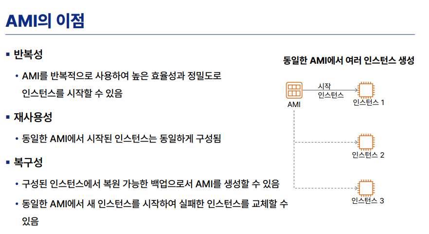

## EC2 & AMI 기반 고가용성 웹 서버 구축 실습


## 요약

## 1. 🔑 핵심 개념 정리

- **온디맨드 (On-Demand):** 초기 비용 없이 약정 없이 사용한 시간(초 단위)만큼만 비용을 지불하는 가장 기본적인 EC2 구매 옵션입니다.
- **하이퍼바이저 (Hypervisor):** 하나의 물리적 서버(호스트 OS) 위에서 여러 개의 가상 머신(게스트 OS)을 독립적으로 띄우고 구동할 수 있도록 중간에서 자원을 분할하고 중계해 주는 가상화 플랫폼 기술입니다.

---

## 🛠️ 2. 실습 프로세스 가이드

### 🟩 STEP 1: 1번 웹 서버 생성 및 Nginx 설정

- 서울 리전(`ap-northeast-2`)에 `t3.micro` 인스턴스를 하나 생성하고 퍼블릭 IP를 할당했습니다.
- 리눅스 터미널에 접속하여 Nginx 웹 서버를 설치하고 가동했습니다.
    
    ```bash
    sudo amazon-linux-extras install nginx1 -y
    sudo systemctl start nginx
    sudo systemctl enable nginx
    ```
    

### 🟨 STEP 2: 나만의 이미지(AMI) 생성

- 1번 서버의 현재 세팅 상태(Nginx 설치 및 웹 소스 코드)를 그대로 스냅샷으로 보존하기 위해 AWS 콘솔에서 `작업 -> 이미지 및 템플릿 -> 이미지 생성`을 통해 커스텀 AMI(Amazon Machine Image)를 빌드했습니다.

### 🟦 STEP 3: AMI 기반 2번 웹 서버 생성 및 이중화

- 새로 만든 커스텀 AMI를 기반으로 2번 인스턴스를 생성했습니다.
- **결과:** OS 설정이나 Nginx 재설치 과정을 거치지 않고도, 부팅되자마자 1번 서버와 완전히 동일한 대문 페이지가 정상 가동되는 **서버 복제 및 가용성 확보 체계**를 검증했습니다.

---
    

# 수업 내용

## 1. 핵심 개념 정리

> 💡 **주요 키워드 복습**
> 
- **AMI (Amazon Machine Image)**
    - **:** OS뿐만 아니라 프로그램, 설정까지 모두 담은 '**나만의 서버 인스턴스 템플릿**'(골든 이미지).
- **고가용성 (High Availability, HA)**
    - **:** 시스템 일부에 **장애가 발생해도 서비스가 중단되지 않고 지속**되는 성질. **최소 2개 이상의 가용 영역(AZ) 분산 배치**와 **로드 밸런서**가 필수.
- **인스턴스 상태의 차이:**
    - **중지(Stop):** 전원 끄기. 자원은 반납되며 다시 켤 때 **퍼블릭 IP가 변경됨** (공유 자원이기 때문).
    - **재부팅(Reboot):** OS 다시 시작. **퍼블릭 IP 유지됨**.
    - **종료(Terminate/삭제):** 인스턴스 영구 삭제 (되살리기 불가능). 중지와 구분해야함 !!

더 자세한 내용 아래에.

## 1. Amazon Machine Image

- AMI는 다음을 비롯하여 **인스턴스를 시작**하는 데 필요한 정보를 제공합니다.
•루트 볼륨용 **템플릿**
－ 게스트 운영 체제(OS) 및 설치된 다른 소프트웨어 포함
• **시작 권한**
－ AMI에 액세스할 수 있는 AWS 계정 제어
**• 블록 디바이스 매핑**
－ 인스턴스에 연결할 스토리지 볼륨 지정




### **'온디맨드(On-Demand)'**

- '**요구할 때**'라는 뜻으로, 소비자가 원하는 시간과 장소에서 **즉각적으로 맞춤형 제품이나 서비스를 제공받는 방식**을 의미합니다.
- 과거 기업 중심의 생산 방식과 달리, **소비자의 수요**가 모든 것을 결정.
- **IT에서의 의미**
    - **:** 사용자의 **요청이나 트래픽**에 따라 서버, 시스템 및 데이터베이스 리소스를 **실시간으로 할당하고 처리 (배치(Batch)** 작업, **스케쥴링**)
    - **배치(Batch) 작업** : 사용자의 실시간 개입 없이 대량의 데이터를 **일괄적으로 모아서 정기적으로 자동 처리**하는 방식

### 하이퍼바이저(Hypervisor)

- **단일 물리적 하드웨어**에서 **여러 개의 가상 머신(VM)**을 **동시에 실행**할 수 있게 해주는 **가상화 소프트웨어 계층**입니다. → CPU, 메모리 등의 **물리 자원을 논리적으로 분할 → 각 가상 환경에 독립적으로 할당** 및 관리
- 이때, 각 가상머신에 **탄력적 IP주소 할당**
    - **탄력적 IP 주소 특성**
        - **대여 :** 동일한 인스턴스 또는 다른 인스턴스에 언제든지 할당하고 다시 매핑할 수 있음
        - 릴리스하도록 선택할 때까지  할당된 상태 유지

## 2. 고가용성 환경 설계


**c.f.** **가용 영역을 2개** 이상 선택하는 이유 → 로드 밸런서가 안만들어짐.


## 3.로드 밸런서

- 로드 밸런서(Load Balancer=**부하분산기**)
- 서버가 처리해야 할 **부하(Load)를 “여러 대의 서버로” 공평하게 나누어주는(Balance) 장치나 소프트웨어**를 말해요.

수업에서 **VPC**와 **서브넷**을 만들고 그 안에 **여러 대의 가상 서버(VM 01, VM 02 등)**를 구축한 이유가 바로 이 로드 밸런서를 사용하기 위한 빌드업이기도 합니다.

#### 1. 로드 밸런서가 필요한 이유

만약 전 세계에서 수만 명의 사용자가 내가 만든 웹사이트에 접속하는데, 서버가 딱 한 대(`VM 01`)뿐이라면 어떻게 될까요?

- **서버 다운(Crash):** 처리 능력을 초과하는 트래픽이 몰리면 서버가 터져버립니다.
- **성능 저하:** 서버가 느려져서 사용자들은 무한 로딩을 겪게 됩니다.

그래서 **보통 똑같은 사양의 서버를 여러 대(VM 01, VM 02, VM 03...)** 만들어 둡니다. 

이때 **맨 앞에 로드 밸런서를 딱 세워두면, 사용자는 로드 밸런서 대표 주소(IP나 도메인) 하나로만 접속**하고→ 로드 밸런서가 **뒤에 있는 서버들의 상태를 보고 트래픽을 골고루 분배**해 줍니다.


- ALB(7계층), NLB(4계층), CLB (혼합)

#### 2. 핵심 기능 3가지

- **부하 분산 (Traffic Distribution):** 여러 대의 서버로 요청을 나누어 단일 서버의 과부하를 방지합니다.
- **상태 확인 (Health Check):** 로드 밸런서는 뒤에 있는 서버들이 살아있는지 주기적으로 핑(Ping)을 날리거나 통신을 시도해 봅니다. 만약 `VM 02`가 고장 나서 응답이 없으면, **정상인 서버(`VM 01`)로만 트래픽을 보내는 똑똑한 기능**을 합니다.
- **고가용성 (High Availability) 확보:** 한두 대의 서버가 장애로 죽더라도 서비스는 멈추지 않고 중단 없이 계속 운영(무중단 서비스)될 수 있게 만듭니다.

#### 4. AWS의 로드 밸런서 정리 (ELB: Elastic Load Balancing)

AWS에서는 이 기능을 **ELB**라는 서비스로 제공하며, 크게 3가지 종류가 있습니다. 면접이나 자격증 시험에서도 단골로 나오는 개념이에요.

| **종류** | **작동 계층 (OSI 7 Layer)** | **주요 특징 및 용도** |
| --- | --- | --- |
| **ALB** (Application Load Balancer) | **7계층 (Application)** | **HTTP, HTTPS** 트래픽 처리에 특화. URL 주소 경로(예: `/images`는 이미지 서버로, `/api`는 API 서버로)나 쿠키를 보고 똑똑하게 분기해 주는 **웹 애플리케이션 전용** 로드 밸런서. |
| **NLB** (Network Load Balancer) | **4계층 (Transport)** | **TCP, UDP** 프로토콜 처리. 할당된 고정 IP를 가질 수 있으며, 초당 수백만 개의 요청을 처리할 수 있을 정도로 **속도가 매우 빠르고 대용량 트래픽**에 적합. |
| **CLB** (Classic Load Balancer) | 4/7계층 혼합 | 예전에 쓰던 구형 로드 밸런서 (현재는 거의 사용하지 않음). |

#### 5. 로드밸런서의 네트워크 구성에서의 위치 (VPC 관점)

네트워크 아키텍처를 설계할 때 보통 **로드 밸런서는 외부 인터넷과 직접 닿아야** 하므로 **퍼블릭 서브넷**에 위치시킵니다.

반면, 실제 소스 코드가 돌아가는 웹 서버나 데이터베이스(DB) 서버들은 보안을 위해 외부에서 직접 들어올 수 없는 **프라이빗 서브넷**에 꽁꽁 숨겨두죠. 사용자는 `인터넷 rightarrow 퍼블릭의 로드 밸런서 \rightarrow 프라이빗의 웹 서버` 경로로 안전하게 접속하게 됩니다.

혹시 지금 수업에서 네트워크 실습 이후에 이 로드 밸런서(ALB)를 생성해서 서버들을 묶는 실습을 진행하고 계시나요?

- OSI 7계층 모델과 로드 밸런서 (Load Balancer)
- **OSI 7계층:** 네트워크 통신 흐름을 설명하기 위한 이론적 모델.
- **클라우드 서비스 선택 시 활용 (중요):**
    - **L7 (애플리케이션 계층) 로드 밸런서:** HTTP/HTTPS 통신을 사용하는 웹사이트 부하 분산 시 적용 (예: AWS ALB).
    - **L4 (전송 계층) 로드 밸런서:** TCP/UDP 프로토콜단에서 정책에 따라 부하를 분산할 때 적용 (예: AWS NLB).

# 프로토콜 / 엔드포인트

**네트워크나 API 통신에서 요청을 주고받는 디지털 종착점(접속점)**을 의미하며, 주로 특정 서비스에 접근할 수 있는 URL 주소로 표현

**1. 주요 개념 및 역할**
• **통신의 접점:** 클라이언트와 서버가 서로 데이터를 교환하기 위해 만나는 통로의 한쪽 끝.
• **API 엔드포인트:** 웹 서비스 등에서 리소스(데이터)에 접근하기 위해 지정된 특정 [**API 엔드포인트 URL**](https://www.ibm.com/kr-ko/think/topics/api-endpoint) 주소를 뜻함.
• **요청과 응답:** 클라이언트가 해당 주소로 요청을 보내면, 서버가 그에 맞는 로직을 실행하여 응답을 반환. 

**2. 구성 예시**
• 예: `https://api.example.com/users` (사용자 정보를 가져오거나 수정하는 엔드포인트)
• 동일한 주소(엔드포인트)라 하더라도 통신 방식(HTTP 메서드인 `GET`, `POST` 등)에 따라 처리하는 작업이 달라질 수 있음. [[1](https://claremont.tistory.com/entry/%EC%9B%B9-%EC%A7%80%EC%8B%9D-%EC%97%94%EB%93%9C%ED%8F%AC%EC%9D%B8%ED%8A%B8Endpoint%EC%97%90-%EB%8C%80%ED%95%B4%EC%84%9C), [2](https://velog.io/@min-zi/Web-API-%EC%97%94%EB%93%9C%ED%8F%AC%EC%9D%B8%ED%8A%B8%EB%9E%80)]

## 2. 실습 전 사전 준비 (VPC 설정)

> 인스턴스 생성 시 공인 IP를 자동으로 할당받기 위해 VPC와 서브넷 설정을 먼저 확인/변경합니다.
> 
- [ ]  **VPC DNS 설정 확인:** `VPC 콘솔` ➡️ `내 VPC` 선택 ➡️ `작업` ➡️ `VPC 설정 편집` ➡️ **DNS 관련 설정 2개 모두 체크** 확인.
- [ ]  **서브넷 IP 자동 할당 활성화:**
    1. `VPC 콘솔` ➡️ `서브넷` ➡️ **마이 서브넷 01** 선택.
    2. `작업` ➡️ `서브넷 설정 편집` ➡️ **[퍼블릭 IPv4 자동 할당 활성화] 체크** 후 저장.
    3. **마이 서브넷 02**도 동일하게 반복 설정.

## 3. 실습 가이드 & 명령어 모음

### 🟩 STEP 1: 1번 웹 서버 생성 및 Nginx 설정

1. **EC2 인스턴스 시작:**
    - **이름:** `my-web01`
    - **네트워크 설정 (편집):** 서브넷을 `마이 서브넷 01` (A존)로 지정.
    - **보안 그룹:** 기존 보안 그룹(`my-web-SG`) 선택 (웹 서버 접근 허용 규칙 포함).
2. **MobaXterm 접속:** 생성된 1번 서버의 퍼블릭 IP와 `my-key.pem` 키페어를 이용해 접속 (사용자 이름: `ec2-user`).
3. **서버 초기 세팅 및 웹 소스 배포 (명령어):**

```
# 1. 패키지 업데이트
sudo dnf update -y

# 2. 필수 프로그램 설치 (Git, Stress Tool, Nginx)
sudo dnf install -y git stress nginx

# 3. Nginx 서비스 시작 및 활성화 (부팅 시 자동 시작)
sudo systemctl start nginx
sudo systemctl enable nginx

# 4. Nginx 실행 상태 확인 (Active: active (running) 확인)
sudo systemctl status nginx --no-pager

# 5. 실습용 웹사이트 소스 다운로드 및 기본 경로 이동
mkdir project && cd project
git clone https://github.com/mary0427/aws-web-demo.git
cd aws-web-demo
sudo cp -r * /usr/share/nginx/html/
```

> 🌐 **확인:** 브라우저 주소창에 `http://[1번서버 퍼블릭 IP]` 입력 시 데모 웹페이지가 뜨면 성공. (※ 주의: `https://` 아님!!!!!)
> 

### 🟨 STEP 2: 나만의 이미지(AMI) 생성

> 1번 서버의 설정을 그대로 복제한 골든 이미지를 만듭니다. (이 과정에서 서버 세션이 일시적으로 리부팅되어 끊길 수 있습니다.)
> 
1. `EC2 콘솔` ➡️ `인스턴스` ➡️ `my-web01` 선택.
2. `작업` ➡️ `이미지 및 템플릿` ➡️ **[이미지 생성]** 클릭.
3. **이미지 이름:** `my-web-image` 입력 후 생성.
4. 왼쪽 메뉴 `이미지` ➡️ `AMI`에서 상태가 [사용 가능(Available)]이 될 때까지 대기.

### 🟦 STEP 3: AMI 기반 2번 웹 서버 생성 및 이중화

> 앞에서 만든 이미지를 사용하면 Nginx 설치나 소스 다운로드 과정을 생략할 수 있습니다. 로드 밸런싱 테스트를 위해 2번 서버의 타이틀만 변경합니다.
> 
1. `EC2 콘솔` ➡️ `인스턴스 시작` 클릭.
2. **이름:** `my-web02`
3. **애플리케이션 및 OS 이미지:** **[내 AMI]** 탭 선택 ➡️ 방금 만든 `my-web-image` 선택.
4. **네트워크 설정 (편집):** 서브넷을 `마이 서브넷 02` (C존)로 지정하여 분산 배치.
5. **보안 그룹:** 기존 보안 그룹(`my-web-SG`) 선택 후 인스턴스 시작.
6. **MobaXterm으로 2번 서버 접속** 후 아래 명령어로 웹페이지 텍스트 수정:

```
# 로드 밸런서 부하 분산 확인을 위해 인덱스 파일의 서버 이름을 2번으로 변경
sudo sed -i 's/Web Server 01/Web Server 02/g' /usr/share/nginx/html/index.html
```

> 🌐 **확인:** 브라우저 주소창에 `http://[2번서버 퍼블릭 IP]` 입력 시 **Web Server 02**로 타이틀이 바뀌어 나오면 성공.
> 

## 4. 요약 및 다음 시간 예고 (오후 수업)

- **현재 구조:** A존(1번 서버), C존(2번 서버)에 각각 똑같은 웹 애플리케이션이 준비됨.
- **오후 실습:** 이 두 서버 앞단에 ELB (Elastic Load Balancing)를 붙여, 사용자가 하나의 주소로 접속했을 때 트래픽이 1번과 2번 서버로 번갈아 분산되는 고가용성(HA) 환경을 완성할 예정.